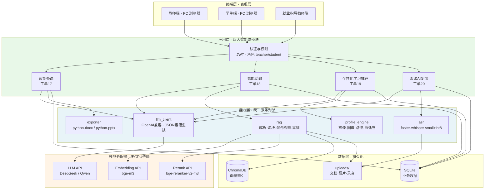
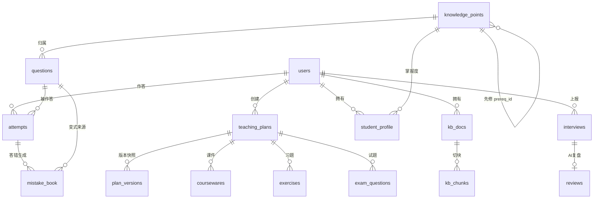
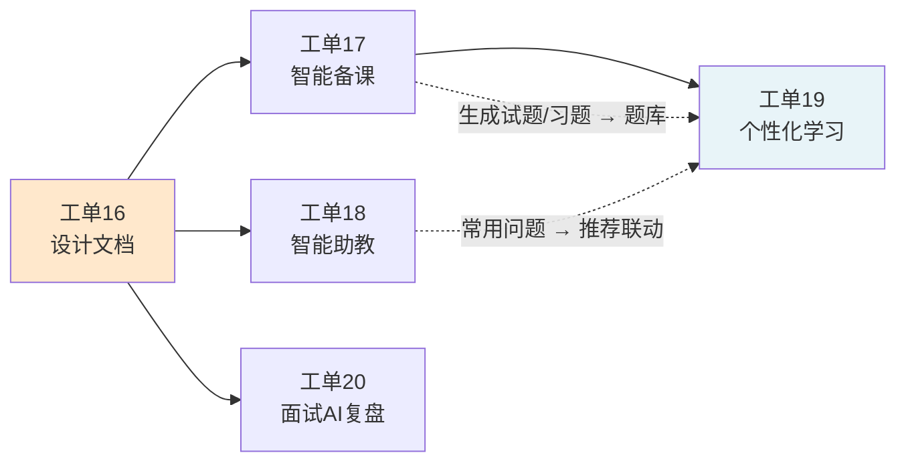

<!-- [工单16] 人工智能NLP-Agent数字人项目-教育智能体-需求分析与功能设计任务 —— 需求分析与软件架构设计文档 -->

# 教育智能体需求分析与软件架构设计

> 工单编号：人工智能NLP-Agent数字人项目-教育智能体-需求分析与功能设计任务
> 项目名称：Agent（教育智能体 · 就读于高职院校场景）
> 编制日期：2026 年 9 月
> 版本：v1.0
>
> 本文档为工单 16 产出物，是后续工单 17（智能备课）、工单 18（智能助教）、工单 19（个性化学习推荐）、工单 20（面试 AI 复盘）实现的**唯一设计依据**。实现过程中若发现设计不妥，**先改本文档再改代码**。

---

## 一、项目背景

### 1.1 政策与行业驱动

| 驱动来源 | 具体要求 | 对本项目的含义 |
| --- | --- | --- |
| 《职业教育信息化 2.0 行动计划》 | 高职院校提升智能化教学与管理水平 | 教学侧需提供备课、答疑、学情分析能力 |
| 《国家职业教育改革实施方案》 | 推动"教师、教材、教法"三教改革 | 备课减负与"双师型"能力补位是刚需 |
| 新兴产业人才需求升级 | 人工智能、数字经济岗位技能要求快速变化 | 课程内容需可快速生成与迭代，教学需与岗位对齐 |
| 《生成式人工智能服务管理暂行办法》 | 内容安全、数据合规、算法备案 | 设计必须包含内容审核与数据合规章节（见第五章） |

### 1.2 高职教育核心痛点

**教学层面**

1. **教师备课负担重**：一门专业课的教案、课件、习题、月考试题需要反复重做，且要贴合本校学情与企业岗位要求。教师大量时间消耗在重复性内容生产上，而非教学设计与个别辅导。
2. **实训资源不足、双师型教师短缺**：产业侧技能更新速度快于教材更新速度，教师难以独立覆盖全部前沿技能点。
3. **学生基础差异大、学习被动**：同一个班内学生的知识基础跨度大，统一进度导致"跟不上的掉队、跟得上的空转"；学生遇到问题缺少即时反馈渠道，问题堆积后放弃。
4. **实操机会有限**：缺乏低成本、可重复的练习与复盘环境。

**管理层面**

1. **行政流程低效**：迎新、审批等流程依赖人工流转。
2. **数据孤岛**：教务、学工、就业数据分散，无法支撑科学决策。
3. **实习就业环节跟踪不足**：**面试过程数据基本为零**——学生面试完即结束，回答得好不好、错在哪、下次怎么改，既无记录也无反馈；老师无法针对性辅导，学生无法有效复盘。这是本项目识别出的**最显著空白**（竞品调研确认：国内 5 家主流教育数字人厂商无一覆盖此场景）。

### 1.3 技术成熟度支撑

| 技术 | 成熟度判断 | 本项目采用方式 |
| --- | --- | --- |
| 大语言模型（LLM） | 已成熟，中文内容生成质量可满足教学场景 | 云端 API（DeepSeek / Qwen，OpenAI 兼容接口） |
| RAG 检索增强生成 | 已成熟，可显著降低幻觉、支持引用溯源 | 自研：向量召回 + 关键词召回 + 云端重排 |
| 语音识别（ASR） | 成熟，small 级模型纯 CPU 可运行 | 本地 faster-whisper small + int8 量化 |
| 多模态文档解析 | 成熟，但高精度方案（MinerU 类）依赖 GPU | CPU 友好的 PyMuPDF / python-docx / python-pptx / openpyxl 组合方案 |
| 数字人形象渲染 | 成熟但**已是商品化能力，不构成壁垒** | 阶段一不做；阶段二用 2D 形象 + TTS 低成本实现；阶段三采购云端 API |

**关于"数字人"的定位说明**

本项目名称中的"数字人"，其完整形态为三层：**教育层（教学策略/学习评价/个性化路径） + AI 层（LLM/RAG/知识库） + 数字人层（Avatar/TTS/口型同步）**。

经竞品调研（《教育数字人竞品调研.md》），国内 5 家主流厂商（讯飞智作、有言、课件帮、臻灵、课灵）在**数字人层均为 4 星以上，该层已是成熟商品，不构成任何壁垒**；而**教育层覆盖普遍浅薄**——5 家无一做到"数字人与学生实时对话 + 背后有真正的教学策略和学情闭环"。该空缺的后半句，正是本阶段要交付的部分。

因此本项目**分阶段实施**：

| 阶段 | 交付内容 | 状态 |
| --- | --- | --- |
| **阶段一** | AI 教学大脑（本设计文档的完整范围，即工单 16~20） | **当前任务** |
| 阶段二 | 数字人层：2D 虚拟形象 + TTS + 音量驱动口型（零 GPU），抽象为可替换 provider | 阶段一全部验收后启动 |
| 阶段三 | 接入云端数字人 API（臻灵 / 讯飞虚拟人），仅替换 provider 实现 | 待定 |
| 阶段四 | 实时全双工教学对话（<200ms、支持打断） | 不在本期范围 |

> **纪律要求**：阶段一完成并验收前，不得引入任何 TTS / Avatar / 口型相关依赖与代码，数字人层不得阻塞或影响教学大脑的交付。

### 1.4 目标用户与价值

| 用户角色 | 核心诉求 | 本项目价值承诺 |
| --- | --- | --- |
| 教师 | 减少重复性备课工作、精准掌握学情 | 备课效率提升；实时查看班级知识点掌握分布 |
| 学生 | 随时答疑、明确"我该学什么"、知道"我错在哪" | 7×24 带引用的答疑；可解释的学习路径；AIGC 错题解析与变式练习 |
| 就业指导教师 | 掌握学生面试表现、针对性辅导 | 面试记录集中管理 + AI 复盘报告（自动打分、逐题点评、优化版回答） |
| 校务管理者 | 打通数据、支撑决策 | 学情与就业数据结构化沉淀（本期提供数据基础） |

---

## 二、需求分析

### 2.1 目标用户

#### 2.1.1 用户角色定义

| 角色 | 标识 | 主要权限 | 首次使用路径 |
| --- | --- | --- | --- |
| 教师 | `teacher` | 备课全流程；管理公共知识库；查看所授班级学情；批量导入面试记录 | 注册/登录 → 智能备课生成课程内容与试题 → 上传课程资料建知识库 |
| 学生 | `student` | 私有知识库；问答；练习与错题本；查看个人画像与路径；填报面试记录 | 注册/登录 → 完成诊断测试或导入历史成绩 → 进入学习路径 |
| 管理员 | `admin` | 公共知识库维护；用户管理 | （本期仅建角色，不实现独立后台） |

#### 2.1.2 用户特征与约束

- **数字素养**：高职院校师生，电脑操作熟练度中等偏上；界面须信息密度合理、操作路径短、无需培训即可上手。
- **使用终端**：以 PC 浏览器为主（实训室/办公室/宿舍）；本期不做移动端适配，仅保证响应式基本可用。
- **并发规模**：单院校试点，预计教师 50~200 人、学生 2000~5000 人；峰值并发问答请求 < 50 QPS。开发期使用 SQLite 足以支撑；生产部署需替换为 PostgreSQL/MySQL（见第六章）。
- **网络环境**：校园网，可访问公网 API；模型调用全部走云端，本地不加载大模型权重。

### 2.2 主要功能场景

#### 场景一：智能备课（对应工单 17）

**痛点**：教师制作一门课的教学材料需 2~3 天，且每年重复。

**功能清单**

1. 生成内容类型：**教案、课件、习题、案例、月考试题**五类
2. 输入参数：学科、课程名、章节、知识点、难度、教学目标
3. 生成方式：调用 LLM（必要时先经 RAG 检索校本资源作为上下文），**SSE 流式返回**，教师实时看到生成过程
4. 在线编辑：生成结果结构化存储为 JSON，支持二次编辑（习题以表格形式编辑）
5. 资源检索与引用：关键词检索校本知识库，结果可一键插入正文并自动标注引用来源
6. **版本管理**：每次保存自动生成版本快照，支持历史版本列表、对比与**回滚**
7. 多格式导出：教案/习题/试题 → **docx**；课件 → **pptx**；接口返回文件流
8. 内容自动入库：生成的习题与试题自动进入题库，供场景三（个性化学习）抽题使用

**用户流程**

```
教师登录 → 进入智能备课 → 填写课程基本信息（课程名/章节/教学目标）
→ 勾选内容类型（教案/课件/习题/案例/试题）→ 提交生成
→ 流式渲染生成过程 → 在线编辑与调整
→ （可选）检索校本资源并插入引用 → 保存（自动生成版本）
→ 导出 docx/pptx 或回滚到历史版本
```

**验收标准**：五类内容均可生成；可编辑保存；版本可回滚；**导出文件内容与编辑结果一致**。

**本期范围界定（已确认）**

| 工单要求 | 本期处理 |
| --- | --- |
| 教案/课件/习题/案例/试题自动生成 | ✅ 完整实现 |
| 在线编辑、资源检索引用、多格式导出 | ✅ 完整实现 |
| 版本管理与历史回溯 | ✅ 完整实现 |
| 多教师协同编辑（WebSocket + Yjs） | ⛔ **本版不做**——单用户演示场景下无法体现价值，投入产出比低 |
| 一键推送到教学管理平台 | 🔁 **降级**为导出文件下载（对接第三方平台需对方接口与授权，非本期可交付） |

#### 场景二：智能助教（对应工单 18）

**痛点**：学生问题无处问、教师重复回答相同问题；校本资料散落在教师个人电脑里，无法复用。

**功能清单**

1. **多格式文档解析入库**：PDF、DOC/DOCX、PPT/PPTX、XLS/XLSX、图像，统一解析
2. **多模态内容处理**：文本、**表格**（转 Markdown 存储）、**图像**（单独成块并记录路径供引用回显）、**公式**（保留原文位置与上下文）分别专门处理
3. **双知识库**：`public`（全校共享，教师/管理员维护）与 `private`（**按用户隔离**，师生各自私有）
4. **混合检索**：向量召回（ChromaDB）+ 关键词召回（BM25），RRF 融合后经**重排序**（bge-reranker-v2-m3，可开关）取 top5
5. **带引用的流式问答**：SSE 输出，答案内嵌 `[1][2]` 角标，底部展示引用来源（文件名 + 页码）；表格以 Markdown 渲染，图像以路径回显
6. 多轮对话：携带最近 N 轮历史

**用户流程**

```
教师/学生登录 → 进入我的知识库 → 拖拽上传文档（PDF/Office/图像）
→ 后台异步解析、切块、向量化入库（界面显示解析状态）
→ 进入问答 → 提问
→ 系统对 private(个人) + public(公共) 双库执行混合检索
→ 重排序取最优 top5 → LLM 基于检索结果流式生成回答
→ 答案带 [n] 角标，底部列出引用来源，可点击回看原文/图片/表格
```

**验收标准**：上传指定 PDF 后提问，**返回带正确引用的流式答案**；能命中指定页码的表格。

**技术说明**：工单备注给出参考项目 HKUDS/RAG-Anything。该项目依赖 MinerU 做版面分析与公式识别，**纯 CPU 环境下 OCR 速度无法接受**（开发机无独立显卡）。本期采用 PyMuPDF（文本/表格/图片抽取）+ python-docx / python-pptx / openpyxl（Office 系列）自研解析管线；公式与复杂版面**降级为保留原文位置与上下文**。若后续部署环境具备 GPU，可平滑替换 `services/parser.py` 的实现。

#### 场景三：个性化学习推荐（对应工单 19）

**痛点**：学生不知道自己的薄弱点在哪，也不知道下一步该学什么；错题只记答案不理解原因，错了还会再错。

**功能清单**

1. **初始化**：复用场景一生成的试题构建课程题库；学生首次登录通过**诊断测试**或**导入历史成绩**建立初始学习画像
2. **知识图谱**：内置"人工智能导论"课程 40+ 知识点及先修关系（如 矩阵运算 → 神经网络 → 反向传播 → 梯度下降），以 `prereq_id` 自关联存储
3. **学生画像**：按知识点加权正确率计算掌握度 `mastery ∈ [0,1]`，引入**时间衰减**（7 天内权重 1.0 / 30 天内 0.7 / 更早 0.4），保证画像随时间反映当前水平
4. **学习路径推荐**：定位 `mastery < 0.6` 的薄弱点，沿知识图谱**上溯到最上游的先修薄弱点**，输出推荐学习顺序，并给出**可解释理由**（"推荐先学 A，因为 A 未掌握且是 B 的前置知识点"）
5. **自适应练习**：连续答对 3 题提升难度档，答错则降档
6. **AIGC 错题本**：答错即触发 LLM 分析，输出【深入浅出的题目解析 + 错误原因诊断 + 2~3 道同知识点变式题（含答案）】；变式题可再答，**再错则重新分析**
7. **联动助教问题库**：基于错题内容与助教侧的常用问题，推荐学习内容与练习题
8. 可视化：掌握度雷达图、学习路径时间线、今日学习任务

**用户流程**

```
学生登录 → 诊断测试 / 导入历史成绩 → 系统生成初始画像
→ 首页仪表盘：掌握度雷达图 + 推荐学习路径 + 今日任务
→ 沿路径学习 → 进入自适应练习（即时反馈，难度自适应）
→ 答错 → 自动进入错题本并触发 AIGC 分析
→ 查看解析与错误原因 → 做变式题巩固 →（再错则重新分析）
→ 答题数据回流 → 画像持续更新 → 路径动态调整（正向循环）
```

**验收标准**：答题 → 画像更新 → 推荐路径，三连结果正确；答错能生成解析与变式题；错题正确入本。

#### 场景四：面试 AI 复盘（对应工单 20）

**痛点**：面试过程零记录，学生无法复盘，教师无法辅导。**竞品调研确认：国内 5 家主流厂商无一覆盖此场景，是最大空白。**

**功能清单**

1. **面试记录列表**：展示学生、岗位名称、面试轮次/形式、面试城市/时间、上报人、上报时间、操作
2. **Excel 批量导入**：就业指导教师批量导入面试记录（openpyxl 解析），返回**逐行成功/失败明细**；提供模板下载
3. **学生自助填报**：学生可自行录入面试记录；可修改**两天内且状态为"待完善"**的记录，修改后**"上报人"变更为该学生姓名**
4. **录音上传**：支持 mp3/wav/m4a，≤50MB，存于 `uploads/audio`
5. **AI 复盘管线（异步）**：
   - ① faster-whisper（small + int8，纯 CPU）转写录音为带说话人轮次的文本
   - ② LLM 分析产出结构化 JSON：`{总分(0-100), 总体评价, 自我介绍点评, questions:[{问题, 学生回答, 得分, 点评, 优化版回答}], 修改建议[]}`
   - ③ 结果存入 `reviews` 表，面试记录状态置为"已复盘"
6. **复盘详情页四区**：总体评价卡片（总分 + 评语 + 自我介绍点评 + 修改建议）／逐题解析（每题打分与点评）／**面试对话左右对照**（左：AI 优化版回答；右：原始完整记录）／修改建议

**用户流程**

```
教师：登录 → 面试列表 → （批量导入 Excel / 或学生自助填报）→ 查看记录
学生：上传面试录音 → 记录状态"待完善"
教师/学生：点击"AI 复盘" → 后台异步执行[转写 → LLM 分析 → 入库]
→ 状态变为"已复盘" → 进入详情页查看四区内容
→ 教师据此针对性辅导 / 学生对照复盘
```

**验收标准**：导入 → 上传录音 → 触发复盘 → 详情页四区完整展示；复盘完成后状态正确流转。

**范围说明**：工单明确"简历投递情况分析不作为本次工单任务核心要解决的问题"（该功能需通过浏览器插件跟踪招聘网站投递行为），本期**不实现**。

### 2.3 非功能性需求

| 类别 | 要求 |
| --- | --- |
| 性能 | 生成类接口首字节 < 3s（SSE 流式）；检索接口 P95 < 2s；文档解析异步执行不阻塞上传响应 |
| 可用性 | 单院校试点，可用性目标 99%（工作时间） |
| 兼容性 | Chrome / Edge 最新版；Windows 服务端 |
| 可维护性 | 分层架构，LLM / Embedding / Rerank / ASR 全部走配置，换模型不改代码 |
| 安全合规 | 见第五章 |
| 成本 | 全部推理走云端 API，无 GPU 硬件投入；开发期 API 成本可控在百元级 |

---

## 三、软件设计架构

### 3.1 总体架构

采用**端—云四层架构**：终端层 / 应用层 / 能力层 / 数据层。核心设计原则是**"本地只跑业务逻辑，AI 重活走云端 API"**，以适配无独立显卡的开发与部署环境。



**阶段二扩展位（本期不实现）**：在"终端层"与"应用层"之间预留**数字人层**（Avatar / TTS / Lip Sync），通过 provider 接口与能力层解耦，接入选型为臻灵或讯飞虚拟人 API。

### 3.2 详细分层说明

#### 3.2.1 终端层

| 组件 | 技术 | 说明 |
| --- | --- | --- |
| 前端框架 | Vue 3 + Vite | 单页应用，路由 `/lesson` `/assistant` `/learn` `/interview` |
| UI 组件库 | Element Plus | 表单、表格、上传、对话框 |
| 图表 | ECharts | 掌握度雷达图、学情分布图 |
| HTTP | axios | 统一实例 + 拦截器（注入 JWT、统一错误处理），开发期经 Vite proxy 转发 `/api` → `localhost:8000` |
| 流式渲染 | fetch + ReadableStream / EventSource | SSE 增量渲染生成内容与问答答案 |
| Markdown 渲染 | marked | 问答答案、表格渲染 |

#### 3.2.2 应用层（接口定义）

统一规范：前缀 `/api`；除认证接口外均需 `Authorization: Bearer <JWT>`；返回体统一为 `{code, msg, data}`（SSE 接口与文件下载接口除外）。

**（0）认证与权限 —— 跨模块基础**

| 方法 | 路径 | 说明 | 权限 |
| --- | --- | --- | --- |
| POST | `/api/auth/register` | 注册（username, password, role, display_name） | 公开 |
| POST | `/api/auth/login` | 登录，返回 JWT | 公开 |
| GET | `/api/auth/me` | 获取当前用户信息 | 登录用户 |

**（1）智能备课（工单 17）**

| 方法 | 路径 | 说明 | 权限 |
| --- | --- | --- | --- |
| POST | `/api/lesson/generate` | 生成内容，`type=教案\|课件\|习题\|案例\|试题`，入参 学科/课程/章节/知识点/难度/教学目标；**SSE 流式**返回 | teacher |
| GET | `/api/lesson/plans` | 备课记录列表（分页、按类型/课程筛选） | teacher |
| GET | `/api/lesson/plans/{id}` | 备课记录详情（含结构化内容 JSON） | teacher |
| PUT | `/api/lesson/plans/{id}` | 编辑保存（自动生成新版本快照） | teacher |
| GET | `/api/lesson/plans/{id}/versions` | 版本列表 | teacher |
| POST | `/api/lesson/plans/{id}/versions/{vid}/rollback` | 回滚到指定版本 | teacher |
| GET | `/api/lesson/plans/{id}/export` | 导出，`?format=docx\|pptx`，返回文件流 | teacher |
| POST | `/api/lesson/resources/search` | 检索可引用校本资源（关键词） | teacher |

**（2）智能助教（工单 18）**

| 方法 | 路径 | 说明 | 权限 |
| --- | --- | --- | --- |
| POST | `/api/kb/upload` | 上传文档并异步解析入库；入参 `scope=public\|private` | 登录用户 |
| GET | `/api/kb/docs` | 文档列表（`?scope=` 筛选），含解析状态 | 登录用户 |
| GET | `/api/kb/docs/{id}` | 文档详情（块数、元数据） | 所有者/公开库 |
| DELETE | `/api/kb/docs/{id}` | 删除文档及其向量块 | 所有者 |
| POST | `/api/kb/search` | 混合检索，返回 top5 及引用元数据（文件名/页码/块类型） | 登录用户 |
| POST | `/api/assistant/chat` | **SSE 流式**问答；入参 question + 可选 conversation_id | 登录用户 |
| GET | `/api/assistant/conversations` | 会话列表 | 登录用户 |
| GET | `/api/assistant/conversations/{id}` | 会话详情（含消息与引用） | 所有者 |

**（3）个性化学习推荐（工单 19）**

| 方法 | 路径 | 说明 | 权限 |
| --- | --- | --- | --- |
| GET | `/api/learn/knowledge-points` | 知识点图谱（含先修关系），用于前端图谱展示 | 登录用户 |
| POST | `/api/learn/answer` | 提交答题，写 attempts 并更新画像；返回对错、正确答案、解析 | student |
| POST | `/api/learn/profile/import` | 导入历史成绩初始化画像 | student |
| GET | `/api/learn/profile` | 当前学生画像（各知识点 mastery） | student |
| GET | `/api/learn/path` | 学习路径推荐（含顺序与可解释理由） | student |
| GET | `/api/learn/practice` | 自适应练习取题（`?kp_id=&count=`），按当前难度档与连对连错状态出题 | student |
| GET | `/api/learn/mistakes` | 错题本列表 | student |
| POST | `/api/learn/mistakes/{id}/analyze` | 触发/重新触发 AIGC 错题分析 | student |
| POST | `/api/learn/mistakes/{id}/variant-answer` | 变式题作答，再错则重新分析 | student |

**（4）面试 AI 复盘（工单 20）**

| 方法 | 路径 | 说明 | 权限 |
| --- | --- | --- | --- |
| GET | `/api/interviews` | 面试列表（分页、按学生/上报人筛选） | 登录用户 |
| POST | `/api/interviews` | 学生自助填报面试记录 | student |
| PUT | `/api/interviews/{id}` | 修改记录（**仅两天内且状态"待完善"**，成功后上报人变更为该学生） | student |
| POST | `/api/interviews/import` | Excel 批量导入，返回逐行成功/失败明细 | teacher |
| GET | `/api/interviews/import-template` | 下载导入模板 | teacher |
| POST | `/api/interviews/{id}/audio` | 上传录音（mp3/wav/m4a，≤50MB） | 登录用户 |
| POST | `/api/interviews/{id}/review` | 触发 AI 复盘（异步任务），返回任务标识 | 登录用户 |
| GET | `/api/interviews/{id}/review` | 获取复盘结果（四区数据） | 登录用户 |

#### 3.2.3 能力层（统一服务封装）

| 服务 | 职责 | 关键设计 |
| --- | --- | --- |
| `llm_client.py` | 统一 LLM 调用 | OpenAI SDK 封装；`base_url`/`model`/`api_key` 全走 .env；**JSON 容错**：失败重试 1 次 + 正则提取首个 `{}` 块宽松解析；支持 `response_format={'type':'json_object'}` |
| `rag.py` | 文档解析、切块、向量化、混合检索、重排 | 切块约 500 字、重叠 80；表格整块不切；图片单独成块记录路径；向量召回 + BM25 召回经 RRF 融合后送重排 |
| `asr.py` | 录音转写 | faster-whisper `small` + int8，纯 CPU；输出按说话人切分的时间段文本 |
| `exporter.py` | 文档导出 | python-docx（教案/习题/试题）、python-pptx（课件） |
| `profile_engine.py` | 画像、图谱、路径、自适应 | mastery 加权正确率 + 时间衰减；图谱上溯算法；连对/连错难度档调整 |

#### 3.2.4 数据层

| 存储 | 用途 | 选型说明 |
| --- | --- | --- |
| SQLite（`data/*.db`） | 业务数据：用户、备课、知识库元数据、题库、画像、错题、面试、复盘 | 单机零配置，开发与试点规模足够。**生产建议迁移 PostgreSQL**（SQLAlchemy 屏蔽差异，改动量小） |
| ChromaDB（`data/chroma`） | 向量索引 | `persist_directory` 持久化；collection 按知识库隔离：`public` 与 `u_{user_id}` |
| 文件系统（`uploads/`） | 原始文档、抽取图片、面试录音 | `uploads/kb/`、`uploads/audio/` |

### 3.3 数据库设计

#### 3.3.1 E-R 关系



#### 3.3.2 建表 SQL

```sql
-- ============================================================
-- 教育智能体平台 建表脚本（SQLite；PostgreSQL 需将 AUTOINCREMENT 改为 SERIAL）
-- ============================================================

-- ---------- 用户与权限（跨工单基础） ----------
CREATE TABLE users (
    id            INTEGER PRIMARY KEY AUTOINCREMENT,
    username      VARCHAR(64)  NOT NULL UNIQUE,
    password_hash VARCHAR(255) NOT NULL,
    role          VARCHAR(16)  NOT NULL CHECK (role IN ('teacher','student','admin')),
    display_name  VARCHAR(64),
    created_at    DATETIME     NOT NULL DEFAULT CURRENT_TIMESTAMP
);
CREATE INDEX idx_users_role ON users(role);

-- ---------- 工单17 智能备课 ----------
-- 备课生成主记录：一次生成任务一条，内容以结构化 JSON 存储以支持二次编辑
CREATE TABLE teaching_plans (
    id              INTEGER PRIMARY KEY AUTOINCREMENT,
    owner_id        INTEGER      NOT NULL REFERENCES users(id),
    content_type    VARCHAR(16)  NOT NULL CHECK (content_type IN ('教案','课件','习题','案例','试题')),
    subject         VARCHAR(64),
    course_name     VARCHAR(128) NOT NULL,
    chapter         VARCHAR(128),
    knowledge_points TEXT,                      -- JSON 数组
    difficulty      VARCHAR(16),                -- 简单|中等|困难
    objectives      TEXT,                       -- JSON 数组，教学目标
    content_json    TEXT         NOT NULL,      -- LLM 生成的结构化内容
    current_version INTEGER      NOT NULL DEFAULT 1,
    created_at      DATETIME     NOT NULL DEFAULT CURRENT_TIMESTAMP,
    updated_at      DATETIME     NOT NULL DEFAULT CURRENT_TIMESTAMP
);
CREATE INDEX idx_plans_owner ON teaching_plans(owner_id, content_type);

-- 版本快照：每次保存生成一条，支持历史回溯与回滚
CREATE TABLE plan_versions (
    id           INTEGER PRIMARY KEY AUTOINCREMENT,
    plan_id      INTEGER  NOT NULL REFERENCES teaching_plans(id) ON DELETE CASCADE,
    version_no   INTEGER  NOT NULL,
    content_json TEXT     NOT NULL,
    created_by   INTEGER  REFERENCES users(id),
    created_at   DATETIME NOT NULL DEFAULT CURRENT_TIMESTAMP,
    UNIQUE (plan_id, version_no)
);

-- 课件结构化内容（plan_id 关联，slides 为 JSON 数组）
CREATE TABLE coursewares (
    id         INTEGER PRIMARY KEY AUTOINCREMENT,
    plan_id    INTEGER NOT NULL REFERENCES teaching_plans(id) ON DELETE CASCADE,
    title      VARCHAR(255),
    slides_json TEXT   NOT NULL,
    created_at DATETIME NOT NULL DEFAULT CURRENT_TIMESTAMP
);

-- 习题（供个性化学习抽题）
CREATE TABLE exercises (
    id             INTEGER PRIMARY KEY AUTOINCREMENT,
    plan_id        INTEGER REFERENCES teaching_plans(id) ON DELETE SET NULL,
    qtype          VARCHAR(16),                 -- 单选|多选|判断|简答
    stem           TEXT NOT NULL,               -- 题干
    options_json   TEXT,                        -- 选项 JSON 数组
    answer         TEXT,                        -- 正确答案
    analysis       TEXT,                        -- 解析
    knowledge_point VARCHAR(128),               -- 知识点标签
    difficulty     VARCHAR(16),
    created_at     DATETIME NOT NULL DEFAULT CURRENT_TIMESTAMP
);
CREATE INDEX idx_exercises_kp ON exercises(knowledge_point);

-- 试题（月考试题，供工单19 抽题）
CREATE TABLE exam_questions (
    id             INTEGER PRIMARY KEY AUTOINCREMENT,
    plan_id        INTEGER REFERENCES teaching_plans(id) ON DELETE SET NULL,
    qtype          VARCHAR(16),
    stem           TEXT NOT NULL,
    options_json   TEXT,
    answer         TEXT,
    analysis       TEXT,
    knowledge_point VARCHAR(128),
    score          INTEGER DEFAULT 0,           -- 分值
    difficulty     VARCHAR(16),
    created_at     DATETIME NOT NULL DEFAULT CURRENT_TIMESTAMP
);
CREATE INDEX idx_exam_kp ON exam_questions(knowledge_point);

-- 可引用校本资源
CREATE TABLE resources (
    id         INTEGER PRIMARY KEY AUTOINCREMENT,
    owner_id   INTEGER REFERENCES users(id),
    title      VARCHAR(255) NOT NULL,
    source     VARCHAR(255),                    -- 来源描述（教材/校本/网络）
    content    TEXT,
    doc_id     INTEGER,                         -- 若来自知识库则关联 kb_docs
    created_at DATETIME NOT NULL DEFAULT CURRENT_TIMESTAMP
);

-- ---------- 工单18 智能助教 ----------
CREATE TABLE kb_docs (
    id           INTEGER PRIMARY KEY AUTOINCREMENT,
    owner_id     INTEGER      REFERENCES users(id),   -- public 库可为 NULL
    scope        VARCHAR(16)  NOT NULL CHECK (scope IN ('public','private')),
    filename     VARCHAR(255) NOT NULL,
    file_path    VARCHAR(512) NOT NULL,
    file_type    VARCHAR(16),                          -- pdf|docx|pptx|xlsx|image
    file_size    INTEGER,
    parse_status VARCHAR(16)  NOT NULL DEFAULT 'pending'
                 CHECK (parse_status IN ('pending','parsing','done','failed')),
    parse_error  TEXT,
    chunk_count  INTEGER DEFAULT 0,
    created_at   DATETIME NOT NULL DEFAULT CURRENT_TIMESTAMP
);
CREATE INDEX idx_kbdocs_scope ON kb_docs(scope, owner_id);

-- 切块：支持多模态类型，citation 元数据齐备以支撑引用溯源
CREATE TABLE kb_chunks (
    id         INTEGER PRIMARY KEY AUTOINCREMENT,
    doc_id     INTEGER NOT NULL REFERENCES kb_docs(id) ON DELETE CASCADE,
    chunk_index INTEGER NOT NULL,                      -- 块序号
    chunk_type VARCHAR(16) NOT NULL DEFAULT 'text'
               CHECK (chunk_type IN ('text','table','image','formula')),
    content    TEXT,                                   -- 文本内容 / 表格 Markdown / 公式 LaTeX
    image_path VARCHAR(512),                           -- 图片类块的文件路径
    page_no    INTEGER,                                -- 页码，引用展示用
    vector_id  VARCHAR(64)                             -- 对应 Chroma 中的向量 id
);
CREATE INDEX idx_chunks_doc ON kb_chunks(doc_id, chunk_index);

-- 问答会话
CREATE TABLE conversations (
    id         INTEGER PRIMARY KEY AUTOINCREMENT,
    user_id    INTEGER NOT NULL REFERENCES users(id),
    title      VARCHAR(255),
    created_at DATETIME NOT NULL DEFAULT CURRENT_TIMESTAMP
);
CREATE TABLE messages (
    id              INTEGER PRIMARY KEY AUTOINCREMENT,
    conversation_id INTEGER NOT NULL REFERENCES conversations(id) ON DELETE CASCADE,
    role            VARCHAR(16) NOT NULL CHECK (role IN ('user','assistant')),
    content         TEXT NOT NULL,
    citations_json  TEXT,                       -- 引用来源 JSON（文件名/页码/块类型）
    created_at      DATETIME NOT NULL DEFAULT CURRENT_TIMESTAMP
);
CREATE INDEX idx_msg_conv ON messages(conversation_id, id);

-- ---------- 工单19 个性化学习 ----------
-- 知识点：prereq_id 自关联构成课程知识图谱
CREATE TABLE knowledge_points (
    id        INTEGER PRIMARY KEY AUTOINCREMENT,
    course    VARCHAR(128) NOT NULL DEFAULT '人工智能导论',
    name      VARCHAR(128) NOT NULL,
    prereq_id INTEGER REFERENCES knowledge_points(id),  -- 先修知识点
    order_no  INTEGER DEFAULT 0,
    UNIQUE (course, name)
);

-- 统一题库（由工单17 的 exercises / exam_questions 汇入）
CREATE TABLE questions (
    id             INTEGER PRIMARY KEY AUTOINCREMENT,
    kp_id          INTEGER REFERENCES knowledge_points(id),
    qtype          VARCHAR(16),
    stem           TEXT NOT NULL,
    options_json   TEXT,
    answer         TEXT,
    analysis       TEXT,
    difficulty     VARCHAR(16) DEFAULT '中等',
    source         VARCHAR(32),                 -- 来自 习题|试题
    source_id      INTEGER,
    created_at     DATETIME NOT NULL DEFAULT CURRENT_TIMESTAMP
);
CREATE INDEX idx_q_kp ON questions(kp_id, difficulty);

-- 答题记录
CREATE TABLE attempts (
    id          INTEGER PRIMARY KEY AUTOINCREMENT,
    student_id  INTEGER NOT NULL REFERENCES users(id),
    question_id INTEGER NOT NULL REFERENCES questions(id),
    kp_id       INTEGER REFERENCES knowledge_points(id),
    user_answer TEXT,
    is_correct  BOOLEAN NOT NULL,
    is_variant  BOOLEAN NOT NULL DEFAULT 0,     -- 是否为变式题作答
    created_at  DATETIME NOT NULL DEFAULT CURRENT_TIMESTAMP
);
CREATE INDEX idx_attempts_stu ON attempts(student_id, kp_id, created_at);

-- 学生画像：按知识点存储掌握度
CREATE TABLE student_profile (
    id         INTEGER PRIMARY KEY AUTOINCREMENT,
    student_id INTEGER NOT NULL REFERENCES users(id),
    kp_id      INTEGER NOT NULL REFERENCES knowledge_points(id),
    mastery    REAL    NOT NULL DEFAULT 0.0,     -- 0~1
    updated_at DATETIME NOT NULL DEFAULT CURRENT_TIMESTAMP,
    UNIQUE (student_id, kp_id)
);

-- 错题本：答错触发 AIGC 分析，变式题可再答、再错重新分析
CREATE TABLE mistake_book (
    id                 INTEGER PRIMARY KEY AUTOINCREMENT,
    student_id         INTEGER NOT NULL REFERENCES users(id),
    question_id        INTEGER NOT NULL REFERENCES questions(id),
    attempt_id         INTEGER REFERENCES attempts(id),
    kp_id              INTEGER REFERENCES knowledge_points(id),
    ai_analysis        TEXT,                     -- JSON：解析 + 错误原因诊断
    variant_questions  TEXT,                     -- JSON：2~3 道变式题（含答案）
    analyze_status     VARCHAR(16) NOT NULL DEFAULT 'pending'
                       CHECK (analyze_status IN ('pending','analyzing','done','failed')),
    variant_tries      INTEGER DEFAULT 0,        -- 变式题重试次数
    created_at         DATETIME NOT NULL DEFAULT CURRENT_TIMESTAMP,
    updated_at         DATETIME NOT NULL DEFAULT CURRENT_TIMESTAMP
);
CREATE INDEX idx_mistake_stu ON mistake_book(student_id, kp_id);

-- 练习难度档状态（自适应：连对3升档 / 答错降档）
CREATE TABLE practice_state (
    id            INTEGER PRIMARY KEY AUTOINCREMENT,
    student_id    INTEGER NOT NULL REFERENCES users(id),
    kp_id         INTEGER NOT NULL REFERENCES knowledge_points(id),
    difficulty    VARCHAR(16) NOT NULL DEFAULT '简单',
    streak_correct INTEGER DEFAULT 0,
    updated_at    DATETIME NOT NULL DEFAULT CURRENT_TIMESTAMP,
    UNIQUE (student_id, kp_id)
);

-- ---------- 工单20 面试AI复盘 ----------
CREATE TABLE interviews (
    id            INTEGER PRIMARY KEY AUTOINCREMENT,
    student_id    INTEGER NOT NULL REFERENCES users(id),
    student_name  VARCHAR(64)  NOT NULL,
    job_title     VARCHAR(128) NOT NULL,        -- 岗位名称
    round         VARCHAR(32),                  -- 面试轮次
    form          VARCHAR(32),                  -- 面试形式（现场/电话/视频）
    city          VARCHAR(64),                  -- 面试城市
    interview_time DATETIME,                    -- 面试时间
    remark        TEXT,
    reporter      VARCHAR(64)  NOT NULL,        -- 上报人（教师姓名 或 学生姓名）
    reported_at   DATETIME     NOT NULL DEFAULT CURRENT_TIMESTAMP,
    audio_path    VARCHAR(512),                 -- 录音文件路径
    status        VARCHAR(16)  NOT NULL DEFAULT '待完善'
                  CHECK (status IN ('待完善','已复盘')),
    created_at    DATETIME NOT NULL DEFAULT CURRENT_TIMESTAMP,
    updated_at    DATETIME NOT NULL DEFAULT CURRENT_TIMESTAMP
);
CREATE INDEX idx_interviews_stu ON interviews(student_id, status);

CREATE TABLE reviews (
    id             INTEGER PRIMARY KEY AUTOINCREMENT,
    interview_id   INTEGER NOT NULL UNIQUE REFERENCES interviews(id) ON DELETE CASCADE,
    total_score    INTEGER,                     -- 总分 0~100
    overall_comment TEXT,                       -- 总体评价
    self_intro_comment TEXT,                    -- 自我介绍点评
    questions_json TEXT,                        -- [{问题,回答,得分,点评,优化版回答}]
    suggestions_json TEXT,                      -- 修改建议数组
    transcript     TEXT,                        -- ASR 原始转写（带说话人轮次）
    status         VARCHAR(16) NOT NULL DEFAULT 'pending'
                   CHECK (status IN ('pending','processing','done','failed')),
    error_msg      TEXT,
    created_at     DATETIME NOT NULL DEFAULT CURRENT_TIMESTAMP,
    updated_at     DATETIME NOT NULL DEFAULT CURRENT_TIMESTAMP
);
```

### 3.4 模块依赖与开发顺序



**开发顺序固定为 16 → 17 → 18 → 19 → 20**。工单 19 的题库来源于工单 17 的试题生成，不可颠倒；工单 20 相对独立，但需在认证体系（3.2.2 节 0 号接口）就绪后开发。

---

## 四、各场景技术选型分析

### 4.1 场景一：智能备课（内容生成）

| 方案 | 优势 | 劣势 | 结论 |
| --- | --- | --- | --- |
| 云端 LLM API（DeepSeek / Qwen） | 中文教学文本质量高、成本低、OpenAI 兼容接口可随时换模型 | 依赖网络；数据出境需评估 | ✅ **采用**。base_url/model 走 .env，换供应商零代码改动 |
| 本地部署开源大模型 | 数据不出内网 | 需 7B 以上模型才有可用质量，**开发机无独立显卡，不可行** | ❌ 排除 |
| 模板填充 + 规则生成 | 零成本、可控 | 内容僵硬、无法适配不同课程，违背"智能"定位 | ❌ 排除 |

**导出方案**

| 方案 | 结论 |
| --- | --- |
| python-docx / python-pptx | ✅ **采用**。纯 Python、无外部依赖、可控性强，满足教案/习题/试题 docx 与课件 pptx |
| LibreOffice headless 转换 | ❌ 需额外安装大型软件，Windows 部署不友好 |
| 前端 JS 生成 | ❌ 中文排版与样式控制困难，且不利于留档 |

**流式输出方案**：SSE（Server-Sent Events）优于 WebSocket——单向推送、实现简单、浏览器原生支持、可穿透大多数反向代理。

### 4.2 场景二：RAG 检索增强

#### 4.2.1 文档解析

| 方案 | 优势 | 劣势 | 结论 |
| --- | --- | --- | --- |
| **PyMuPDF + python-docx/pptx + openpyxl 自研** | 纯 CPU、速度快、依赖轻、可控 | 公式与复杂版面识别能力弱 | ✅ **本期采用**（公式降级为保留原文位置） |
| MinerU / RAG-Anything（工单备注参考） | 版面分析、公式识别、图表理解能力强 | **依赖 GPU 加速**，纯 CPU 跑 OCR 速度不可接受 | ⚠️ 解析器已抽象为独立模块，后续有 GPU 环境可平滑替换 |
| 云端文档解析 API | 免运维、能力强 | 数据需上传第三方（院校数据合规风险）、按量计费 | ❌ 本期不采用 |

#### 4.2.2 向量化与检索

| 环节 | 选型 | 说明 |
| --- | --- | --- |
| Embedding | **云端 API：BAAI/bge-m3**（硅基流动）为首选，阿里 text-embedding-v3 备选；本地兜底 bge-small-zh-v1.5 | bge-m3 中文效果与多语言能力强；**本地 bge-m3 需 GPU，禁用** |
| 向量库 | **ChromaDB** | pip 安装即用、`persist_directory` 持久化、支持元数据过滤；试点规模够用。生产可换 Milvus |
| 关键词召回 | **BM25（自实现 / rank-bm25）** | 弥补向量检索对专有名词、代码符号、公式编号不敏感的短板 |
| 融合 | **RRF（Reciprocal Rank Fusion）** | 无需调参、对两路分数尺度不敏感 |
| 重排序 | **BAAI/bge-reranker-v2-m3**（云端 API） | 显著提升 top5 精度；开发期 `RERANK_ENABLED=false` 跳过，验收前开启 |

#### 4.2.3 知识库隔离

知识库分 `public` 与 `private` 两类。隔离通过**三重保障**实现：① 数据库层 `owner_id` 字段；② 向量库层面 collection 分离（`public` / `u_{user_id}`）；③ 接口层强制按当前用户过滤。检索时对私有库与公共库分别召回后合并，保证"用得着校本资源、又不越权看到他人资料"。

### 4.3 场景三：推荐引擎

| 方案 | 优势 | 劣势 | 结论 |
| --- | --- | --- | --- |
| **知识图谱 + 规则推理**（基于 `prereq_id` 先修关系） | **完全可解释**（"因 A 是 B 的前置且未掌握"）、冷启动即可用、零额外依赖 | 需人工维护知识点图谱 | ✅ **采用**。工单明确要求"路径推荐必须基于知识图谱……增强推荐的可解释性" |
| 协同过滤 | 能发现"相似学生"的偏好 | **冷启动失效**（试点期无足够行为数据）；结果不可解释 | ❌ 本期不采用 |
| Neo4j 图数据库 | 图查询表达力强 | 引入独立服务，运维成本高；40+ 知识点的规模用不着 | ❌ 本期用 SQLite 自关联替代，规模增长后可迁移 |
| 深度学习推荐模型 | 理论上限高 | 需大量训练数据与 GPU | ❌ 排除 |

**画像算法**：对每个知识点，取该生在该知识点下所有作答记录，按 `正确 × 时间衰减权重` 加权平均得到 `mastery`。时间衰减权重：7 天内 1.0、30 天内 0.7、更早 0.4。该设计保证画像既反映历史积累，又能体现"最近进步/退步"。

### 4.4 场景四：语音识别（ASR）

| 方案 | 优势 | 劣势 | 结论 |
| --- | --- | --- | --- |
| **faster-whisper `small` + int8 量化（本地 CPU）** | **零成本、数据不出本机（录音含学生个人信息，合规友好）**、无网络依赖、14 核 CPU 接近实时 | 精度低于 large；方言/强噪声环境有错字 | ✅ **采用**。转写结果再由 LLM 做文本纠错与专业术语校准，可弥补精度差距 |
| whisper `medium` / `large` | 精度更高 | **无 GPU 环境下速度不可接受**（large 在 CPU 上远慢于实时），且违背硬性算力约束 | ❌ 排除 |
| 云端 ASR（阿里 Paraformer 等） | 精度高、免运维 | **录音需上传第三方**——面试录音含学生个人身份信息，合规风险高；按量计费 | ⚠️ 作为兜底备选，需先通过合规评估 |
| 其他本地 ASR（Vosk 等） | 更轻量 | 中文识别精度明显低于 whisper 系列 | ❌ 排除 |

**成本对比结论**：本方案在开发机（Intel Core Ultra 5 125H，14 核，无独立显卡）上可满足工单 20 验收演示需求，且无任何按量计费与数据出境风险。

### 4.5 技术选型总表

| 层 | 选型 | 关键理由 |
| --- | --- | --- |
| 后端 | Python 3.11+ / FastAPI / SQLAlchemy 2.x / SQLite | 异步支持好、SSE 实现简单、开发效率高 |
| 前端 | Vue 3 + Vite + Element Plus + ECharts + axios | 国内生态成熟、组件齐全、图表能力满足学情可视化 |
| LLM | 云端 OpenAI 兼容 API（DeepSeek / Qwen） | 中文教学质量与成本最优，可随时切换供应商 |
| Embedding | 云端 bge-m3（本地兜底 bge-small-zh-v1.5） | 中文效果强；本地兜底保证断网可用 |
| 重排序 | 云端 bge-reranker-v2-m3（可开关） | 精度提升显著，开发期可关闭以降本 |
| 向量库 | ChromaDB | 零运维、持久化简单 |
| ASR | faster-whisper small + int8（本地 CPU） | 零成本、零数据出境风险 |
| 导出 | python-docx / python-pptx | 纯 Python，样式可控 |
| 部署 | 单机部署，本地化/私有化可行 | 院校场景必须支持私有化 |

---

## 五、数据安全与合规

### 5.1 身份认证与权限管理

| 措施 | 实现 |
| --- | --- |
| 认证方式 | JWT（Bearer Token），签发后由前端存于本地并在每次请求的 `Authorization` 头携带 |
| 密码存储 | **仅存哈希**（bcrypt / passlib），禁止明文或可逆加密存储 |
| 角色权限 | 三种角色 `teacher` / `student` / `admin`，接口层通过 FastAPI 依赖注入 `require_role()` 强制校验 |
| 越权防护 | 所有涉及个人数据的查询**强制附加 `user_id` 过滤条件**（私有知识库、答题记录、错题本、面试记录、会话历史） |
| 会话时效 | JWT 有效期通过 `JWT_EXPIRE_MINUTES` 配置，默认 7 天，过期需重新登录 |

### 5.2 数据安全

| 类别 | 措施 |
| --- | --- |
| 密钥管理 | 所有 API Key 仅存于 `.env`，`.gitignore` 强制排除，**严禁写入代码或提交至仓库**；`.env.example` 仅含占位符 |
| 传输安全 | 生产部署启用 HTTPS（TLS 1.2+），防止 Token 与内容被窃听 |
| 存储安全 | 数据库文件与 `uploads/` 目录仅服务进程可读；生产环境数据库启用静态加密；定期备份 |
| 文件上传安全 | 白名单校验扩展名（`.pdf/.doc/.docx/.ppt/.pptx/.xls/.xlsx/.png/.jpg/.mp3/.wav/.m4a`）；限制文件大小（文档 ≤20MB、录音 ≤50MB）；**上传文件名重命名存储**，防路径穿越；解析在受限环境中执行 |
| 注入防护 | ORM（SQLAlchemy）参数化查询，禁止拼接 SQL |
| 日志安全 | 日志中**不得记录**密码、Token、API Key、录音转写原文等敏感信息 |

### 5.3 个人信息保护（重点：面试录音）

面试录音与转写文本包含学生**个人身份信息、口述的实习经历与可能的企业信息**，属敏感个人信息，须重点保护：

1. **最小化采集**：录音仅用于生成复盘报告，不用于任何其他目的；
2. **本地化处理**：ASR 采用本地 faster-whisper，**录音不出本机**，从源头规避数据出境与第三方留存风险；
3. **访问控制**：面试记录与复盘结果仅该学生本人、就业指导教师及管理员可访问；
4. **可删除**：提供删除接口，学生毕业后或提出申请时可清除录音与转写文本；
5. **未成年人保护**：若涉及未成年学生，须取得监护人同意后方可上传录音。

### 5.4 生成式 AI 内容合规

依据《生成式人工智能服务管理暂行办法》：

| 要求 | 本设计对应措施 |
| --- | --- |
| 内容安全 | 在 System Prompt 中明确约束生成内容须符合教学规范与社会主义核心价值观；对输出做敏感内容检测 |
| 标注义务 | 所有 AI 生成内容在界面明确标注"**AI 生成，请教师复核**"；导出文档页脚保留标识 |
| 准确性提示 | AI 生成的教案、习题、试题**须经教师审核后方可用于教学**；问答结果标注引用来源以便核查 |
| 幻觉控制 | RAG 强制基于检索到的资料作答；检索无结果时明确告知"未在知识库中找到依据"，不编造 |
| 教师主体责任 | 强调 AI 为辅助工具，教学内容的最终责任由教师承担 |

### 5.5 合规与部署建议

| 事项 | 建议 |
| --- | --- |
| 私有化部署 | 院校客户对数据本地化有强需求——本设计支持单机私有化部署，所有业务数据与文件均存于本地 |
| 第三方 API 合规 | 调用云端 LLM / Embedding 前需评估数据出境与供应商协议；**敏感数据（面试录音）不送第三方**（ASR 本地化正是为此） |
| 算法备案 | 面向公众提供服务时需按监管要求完成算法备案 |
| 数据留存 | 明确各类数据的留存期限与销毁流程；建议学籍相关数据留存不超过必要期限 |
| 审计日志 | 关键操作（登录、导出、删除、复盘触发）记录操作日志，保留不少于 6 个月 |

---

## 六、实施建议

### 6.1 资源规划

#### 6.1.1 开发环境（本项目实际配置）

| 项目 | 配置 | 说明 |
| --- | --- | --- |
| 开发机 | Intel Core Ultra 5 125H / 32GB 内存 / Intel Arc 核显 | **无独立显卡**，故所有 AI 重活走云端 API |
| 操作系统 | Windows 11 | 需注意 UTF-8 编码与 HuggingFace 镜像配置 |
| 运行时 | Python 3.12 / Node.js 22+ | — |
| 编程工具 | Claude Code（智能编程工具，工单备注许可） | — |

#### 6.1.2 云端资源与成本

| 资源 | 选型 | 成本估算（开发+试点期） |
| --- | --- | --- |
| LLM API | DeepSeek（约 1~2 元/百万 token） | 开发测试全周期 **≤ 100 元** |
| Embedding API | 硅基流动 bge-m3（有免费额度） | 免费额度内可覆盖开发测试 |
| Rerank API | 硅基流动 bge-reranker-v2-m3 | 开发期关闭，验收前开启，成本可忽略 |
| ASR | 本地 faster-whisper | **0 元** |
| 服务器 | 单机部署（开发期用开发机即可） | 0 元 |
| **合计** | | **约 100 元以内** |

> 说明：本方案不产生任何 GPU 硬件采购成本，这是"本地只跑业务逻辑、AI 重活走云端"策略的直接收益。

#### 6.1.3 人力资源

| 角色 | 人数 | 职责 |
| --- | --- | --- |
| 全栈开发（AI 辅助） | 1 | 需求设计、前后端开发、测试、文档 |
| 课程内容提供方 | 0.2（兼职） | 提供"人工智能导论"课程知识点体系与校本资料 |

#### 6.1.4 数据资源准备

| 资源 | 用途 | 责任方 |
| --- | --- | --- |
| "人工智能导论"课程 40+ 知识点及先修关系 | 工单19 知识图谱 | 课程教师 |
| 人工智能专业课程教材 / 校本讲义 / 课件 | 工单18 公共知识库；工单17 资源引用 | 课程教师 |
| 面试记录 Excel 样例、面试录音样例 | 工单20 验收演示 | 就业指导教师 |

### 6.2 工时安排（对齐工单 16~20，共 9 人日）

| 工单 | 模块 | 工单预估 | 主要交付物 | 依赖 |
| --- | --- | --- | --- | --- |
| **16** | 需求分析与功能设计 | **1 人日** | 本文档 | 无 |
| **17** | 智能备课 | **2 人日** | 生成/编辑/版本/导出接口 + `/lesson` 前端 + pytest | 16 |
| **18** | 智能助教 | **2 人日** | 多模态解析入库 + 混合检索 + 带引用流式问答 + `/assistant` 前端 + pytest | 16 |
| **19** | 个性化学习推荐 | **2 人日** | 知识图谱 + 画像 + 路径推荐 + 自适应练习 + AIGC错题本 + `/learn` 前端 + pytest | 17 |
| **20** | 面试 AI 复盘 | **2 人日** | Excel导入 + 录音上传 + ASR + LLM复盘 + `/interview` 前端 + pytest | 16 |
| | **合计** | **9 人日** | | |

#### 详细排期（按天）

| 天 | 内容 | 里程碑验收 |
| --- | --- | --- |
| Day 0 | 项目初始化（git、目录、`.env.example`、技术栈验证） | 前后端空项目可启动 |
| Day 1 | 工单16 设计文档 | 六章齐全、评审通过 |
| Day 2 | 工单17 后端 | 生成接口 + 导出 + pytest 全绿 |
| Day 3 | 工单17 前端 | 浏览器走通：填表 → 生成 → 编辑 → 版本回滚 → 导出 docx/pptx |
| Day 4 | 工单18 解析入库 + 检索 | 上传 PDF 能检索到指定页表格 |
| Day 5 | 工单18 问答 + 前端 | 提问返回带 `[引用]` 的流式答案 |
| Day 6 | 工单19 图谱 + 画像 + 路径 | 答题 → 画像更新 → 推荐路径三连正确 |
| Day 7 | 工单19 错题本 + 前端 | 答错生成解析与变式题；雷达图/时间线展示正常 |
| Day 8 | 工单20 列表 + 导入 + ASR | Excel 导入成功（含失败明细）；录音转写出文本 |
| Day 9 | 工单20 复盘 + 前端 + 总联调 | 复盘详情页四区完整展示；全模块联调通过 |

#### 跨工单基础工作说明

上表未单列"认证与权限"工时——该模块（`users` 表、JWT、角色依赖注入）作为**跨工单基础**，在 Day 2 工单17 后端开工时一并实现（约 0.3 人日，已含在工单17 的 2 人日内）。工单18 的私有知识库隔离、工单19 的 `student_id`、工单20 的"上报人"均依赖该模块。

### 6.3 风险与应对

| 风险 | 影响 | 应对措施 |
| --- | --- | --- |
| 无 GPU 导致本地模型不可用 | 部分方案（MinerU 解析、本地 bge-m3、whisper large）不可行 | 已通过架构设计规避：AI 重活全部走云端 API；ASR 用 small+int8；解析用 CPU 友好方案 |
| LLM 返回 JSON 格式不稳定 | 结构化解析失败，生成流程中断 | 统一封装"失败重试 1 次 + 正则提取 `{}` 块宽松解析"；DeepSeek 启用 `json_object` 模式 |
| 云端 API 不可用/欠费 | 全部生成与问答功能中断 | 关键接口降级提示；准备备选供应商（Qwen），切换仅需改 `.env` |
| 复杂版面文档解析质量差 | 工单18 检索命中率低 | 表格整块保留、图片独立成块并回显；必要时对关键校本资料做人工校对后的结构化录入 |
| ASR 转写精度不足 | 复盘质量下降 | 转写文本交由 LLM 做纠错与专业术语校准；演示前用清晰录音验证 |
| 知识点图谱需人工维护 | 工单19 前期准备耗时 | 先内置"人工智能导论"40+ 知识点覆盖验收，后续按课程逐步扩充 |
| 协同编辑等重功能挤占工期 | 核心功能无法按期交付 | 已在 2.2 节明确范围界定，协同编辑与平台推送本期不做/降级 |

### 6.4 交付物清单

| 类别 | 交付物 | 对应工单 |
| --- | --- | --- |
| 设计文档 | 本文档（六章） | 16 |
| 技术设计 | UML 流程图、接口设计、数据库设计（本文档第三章） | 17/18/19/20 |
| 源码 | `backend/` + `frontend/`（文件头注释含工单编号） | 17/18/19/20 |
| 测试 | `backend/tests/pytest_工单*.py` 及运行结果 | 17/18/19/20 |
| 验收证据 | `docs/evidence/工单XX/` 截图与录屏 | 16~20 |

### 6.5 后续演进方向

| 阶段 | 内容 | 前置条件 |
| --- | --- | --- |
| 阶段二 | 数字人形象层：前端 2D 虚拟形象 + TTS + 音量驱动口型；抽象为可替换 provider | **工单16~20 全部验收通过** |
| 阶段三 | 接入云端数字人 API（臻灵 / 讯飞虚拟人），仅替换 provider 实现 | 阶段二完成；商务采购落地 |
| 阶段四 | 实时全双工教学对话（<200ms、支持打断） | 阶段三完成 |
| 并行方向 | 管理侧智能体（教务管理、迎新、智能办公助手） | 本期不含 |

> **纪律要求**：阶段划分严格串行。阶段一（工单 16~20）全部完成并通过验收之前，不得开始数字人层开发，数字人层不得阻塞或影响工单交付。
