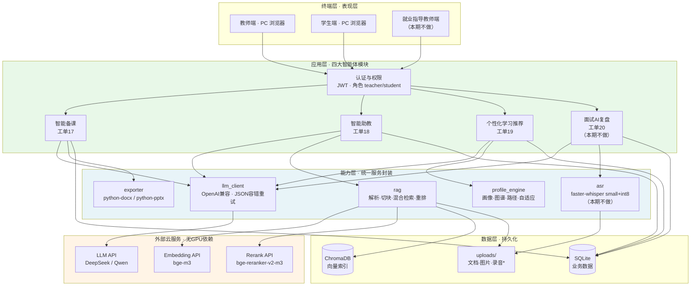
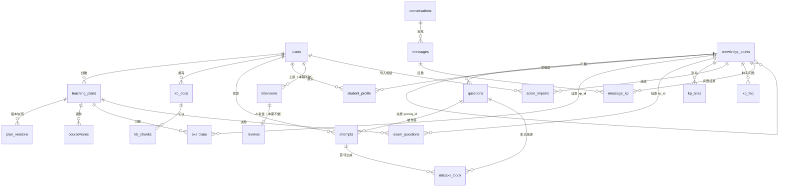
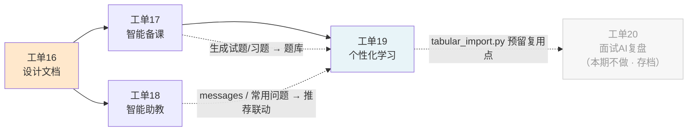

<!-- [工单16] 人工智能NLP-Agent数字人项目-教育智能体-需求分析与功能设计任务 —— 需求分析与软件架构设计文档 -->

# 教育智能体需求分析与软件架构设计

> 工单编号：人工智能NLP-Agent数字人项目-教育智能体-需求分析与功能设计任务
> 项目名称：Agent（教育智能体 · 就读于高职院校场景）
> 编制日期：2026 年 9 月
> 版本：v1.3（2026-09-17 修订；三条"文档—代码"勘误 + 五项范围决策落定）
>
> 本文档为工单 16 产出物，是后续工单 17（智能备课）、工单 18（智能助教）、工单 19（个性化学习推荐）实现的**唯一设计依据**。实现过程中若发现设计不妥，**先改本文档再改代码**。
>
> **工单 20（面试 AI 复盘）已移出本期交付范围**（v1.2，2026-09-17 用户决策）。其需求原文仍存于 `docs/requirements/工单20-面试AI复盘.md`；本设计文档中的对应内容**作为存档保留**（2.2 场景四、3.2.2 接口第(4)组、3.3.2 附录 DDL、4.x ASR 选型、5.3 个人信息保护、第六章排期位置），并逐处标注「本期不做」——**保留而非删除，是为了避免"需求文档有、设计文档无"的断裂**，同时便于后续迭代直接启用。**本期交付范围 = 工单 16 → 17 → 18 → 19。**
>
> **v1.1 修订范围**（工单 16/17/18 已完成部分的设计与代码不再改动，本次仅细化未开工的工单 19，并补记两项前置修复）：
>
> | 位置 | 修订内容 |
> | --- | --- |
> | 2.2 场景三 / 场景四 | 补齐历史成绩导入口径、助教问题库挂靠出口、图谱纯净度约束；工单 20 明确复用表格解析模块 |
> | 3.2.2 应用层 | 工单 19 接口清单由 9 条扩充至 16 条 |
> | 3.2.3 能力层 | 新增 `kp_match.py`、`tabular_import.py` 两个共享服务 |
> | **3.2.5（新增）** | 知识点统一匹配模块设计：一处实现、三个调用方、兜底策略参数化 |
> | 3.3.1 / 3.3.2 | 新增 4 张表与 3 处加列，**以增量 DDL 呈现，不改动工单 17/18 已交付的建表语句** |
> | **3.3.3（新增）** | 工单 19 增量迁移与两项前置修复（SQLite 外键未启用、`create_all` 不建列） |
> | 3.4 / 4.3 / 6.2 / 6.3 | 依赖关系、推荐引擎选型、排期与风险同步更新 |
> | 二轮复核补丁（同日） | 导入接口改为双载荷（文件 + JSON 行）、「相关提问」跳转按来源区分、`kp_faq` 加唯一键并明确聚合职责挂在 `/kp/sync?target=faq`、补齐 `MatchResult` 与别名表写库责任、检索改用公开入口 `retriever.search()`、`/learn` 四页与时间线归属厘清、`score_imports` 加除零约束、补记 `DELETE /api/assistant/conversations/{id}` |
> | 三轮复核补丁（同日） | ① `questions` 汇入口径收口：划归工单19 `/kp/sync?target=questions`（**先汇入、再挂 `kp_id`**），加幂等键与 `difficulty` 归一化，场景一第 8 条补勘误；② 新增 **3.2.6** 工单17 生成提示词的字段与取值约束修正；③ 画像权威来源写死（实时计算 / `student_profile` 纯缓存，三处刷新时机）；④ §5.1 越权防护补跨用户聚合唯一例外；⑤ `kp/unclassified` 取数口径与 `kp/merge` 语义放宽（支持误挂改判）；⑥ 迁移与 seed 拆为两个脚本；⑦ `message_kp` 惰性补挂；⑧ 新增配置项 `ASSISTANT_HOTQ_ENABLED`；⑨ `is_placeholder` 多课程说明 |
> | **v1.2 范围调整（同日）** | **工单 20（面试 AI 复盘）移出本期交付范围**，本期 = 工单 16→17→18→19；**连带移出 ASR（`faster-whisper`）**——工单 18 无音频需求，工单 20 是其在阶段一的唯一消费方；设计内容全部保留为存档并逐处标注「本期不做」；工时 9 → 7 人日；文档头、1.2/1.3/1.4、2.1.1、场景四、架构图、3.2.2~3.2.4、3.3.1/3.3.2、3.4、4.x、5.1/5.3/5.4、6.1.4/6.2/6.3 同步 |
> | **v1.3 勘误与补充（同日）** | **三条勘误（文档与已交付代码不符）**：① `POST /api/kb/upload` 权限更正为「登录用户（`scope=public` 时仅教师/管理员）」——公共库仅教师可写（`kb.py:128`），原文档写"登录用户"；② 给 `practice_state.difficulty` 补 `CHECK (difficulty IN ('简单','中等','困难'))`，使 3.2.6 所称"与 CHECK 约束对不上"成立（该表为工单19 **新建**表，零成本）；③ 补记 5 条已交付接口——工单17 `GET /api/lesson/resources`、`GET /api/lesson/stats`，工单18 `POST /api/kb/docs/{id}/reparse`、`GET /api/kb/chunks/{id}`、`GET /api/kb/chunks/{id}/image`。**五项范围决策**：④ 验收顺序定为"先修 3.2.6 提示词 → 重跑 57 用例 → 重新生成演示数据 → 再验收工单17"；⑤ 新增**试卷模式**（对齐原文"完成练习和考试"）：`GET /api/learn/exam` + `POST /api/learn/exam/submit`，`attempts` 加 `is_exam` 列；⑥ 新增 **3.2.7 AIGC 错题分析 Prompt 结构** + `knowledge_points.common_misconceptions` 列（seed 预置 5~8 个高频知识点）；⑦ 4.3 明示"Embedding 向量化画像 / 平台浏览数据源"本期不做及理由；⑧ `/learn/path` 每个节点补 `/related` 资料入口（复用同一接口，成本≈0） |

---

## 一、项目背景

### 1.1 政策与行业驱动

| 驱动来源 | 具体要求 | 对本项目的含义 |
| --- | --- | --- |
| 《职业教育信息化 2.0 行动计划》 | 高职院校提升智能化教学与管理水平 | 教学侧需提供备课、答疑、学情分析能力 |
| 《国家职业教育改革实施方案》 | 推动"教师、教材、教法"三教改革 | 备课减负与"双师型"能力补位是刚需 |
| 新兴产业人才需求升级 | 人工智能、数字经济岗位技能要求快速变化 | 课程内容需可快速生成与迭代，教学需与岗位对齐 |
| 《生成式人工智能服务管理暂行办法》 | 内容安全、数据合规、算法备案 | 设计必须包含内容审核与数据合规章节（见第五章） |

### 1.2 高职教育核心痛点

**教学层面**

1. **教师备课负担重**：一门专业课的教案、课件、习题、月考试题需要反复重做，且要贴合本校学情与企业岗位要求。教师大量时间消耗在重复性内容生产上，而非教学设计与个别辅导。
2. **实训资源不足、双师型教师短缺**：产业侧技能更新速度快于教材更新速度，教师难以独立覆盖全部前沿技能点。
3. **学生基础差异大、学习被动**：同一个班内学生的知识基础跨度大，统一进度导致"跟不上的掉队、跟得上的空转"；学生遇到问题缺少即时反馈渠道，问题堆积后放弃。
4. **实操机会有限**：缺乏低成本、可重复的练习与复盘环境。

**管理层面**

1. **行政流程低效**：迎新、审批等流程依赖人工流转。
2. **数据孤岛**：教务、学工、就业数据分散，无法支撑科学决策。
3. **实习就业环节跟踪不足**：**面试过程数据基本为零**——学生面试完即结束，回答得好不好、错在哪、下次怎么改，既无记录也无反馈；老师无法针对性辅导，学生无法有效复盘。这是本项目识别出的**最显著空白**（竞品调研确认：国内 5 家主流教育数字人厂商无一覆盖此场景）。
   > **v1.2 范围说明**：该痛点客观成立，作为需求洞察与后续迭代依据**保留**；但对应场景（工单 20）**已移出本期交付范围**（见 2.2 场景四），故**本期并不声称已解决该空白**。本期实际交付的教学能力集中在备课、答疑与个性化学习三环。

### 1.3 技术成熟度支撑

| 技术 | 成熟度判断 | 本项目采用方式 |
| --- | --- | --- |
| 大语言模型（LLM） | 已成熟，中文内容生成质量可满足教学场景 | 云端 API（DeepSeek / Qwen，OpenAI 兼容接口） |
| RAG 检索增强生成 | 已成熟，可显著降低幻觉、支持引用溯源 | 自研：向量召回 + 关键词召回 + 云端重排 |
| 语音识别（ASR） | 成熟，small 级模型纯 CPU 可运行 | 本地 faster-whisper small + int8 量化（**随工单 20 移出本期，本期不做**） |
| 多模态文档解析 | 成熟，但高精度方案（MinerU 类）依赖 GPU | CPU 友好的 PyMuPDF / python-docx / python-pptx / openpyxl 组合方案 |
| 数字人形象渲染 | 成熟但**已是商品化能力，不构成壁垒** | 阶段一不做；阶段二用 2D 形象 + TTS 低成本实现；阶段三采购云端 API |

**关于"数字人"的定位说明**

本项目名称中的"数字人"，其完整形态为三层：**教育层（教学策略/学习评价/个性化路径） + AI 层（LLM/RAG/知识库） + 数字人层（Avatar/TTS/口型同步）**。

经竞品调研（《教育数字人竞品调研.md》），国内 5 家主流厂商（讯飞智作、有言、课件帮、臻灵、课灵）在**数字人层均为 4 星以上，该层已是成熟商品，不构成任何壁垒**；而**教育层覆盖普遍浅薄**——5 家无一做到"数字人与学生实时对话 + 背后有真正的教学策略和学情闭环"。该空缺的后半句，正是本阶段要交付的部分。

因此本项目**分阶段实施**：

| 阶段 | 交付内容 | 状态 |
| --- | --- | --- |
| **阶段一** | AI 教学大脑（本设计文档的完整范围，即工单 16~19；**原工单 20 已移出**，见 2.2 场景四） | **当前任务** |
| 阶段二 | 数字人层：2D 虚拟形象 + TTS + 音量驱动口型（零 GPU），抽象为可替换 provider | 阶段一全部验收后启动 |
| 阶段三 | 接入云端数字人 API（臻灵 / 讯飞虚拟人），仅替换 provider 实现 | 待定 |
| 阶段四 | 实时全双工教学对话（<200ms、支持打断） | 不在本期范围 |

> **纪律要求**：阶段一完成并验收前，不得引入任何 TTS / Avatar / 口型相关依赖与代码，数字人层不得阻塞或影响教学大脑的交付。

### 1.4 目标用户与价值

| 用户角色 | 核心诉求 | 本项目价值承诺 |
| --- | --- | --- |
| 教师 | 减少重复性备课工作、精准掌握学情 | 备课效率提升；实时查看班级知识点掌握分布 |
| 学生 | 随时答疑、明确"我该学什么"、知道"我错在哪" | 7×24 带引用的答疑；可解释的学习路径；AIGC 错题解析与变式练习 |
| 就业指导教师 | 掌握学生面试表现、针对性辅导 | 面试记录集中管理 + AI 复盘报告（自动打分、逐题点评、优化版回答）。**v1.2：本角色仅服务于工单 20，本期不做** |
| 校务管理者 | 打通数据、支撑决策 | 学情与就业数据结构化沉淀（本期提供数据基础） |

---

## 二、需求分析

### 2.1 目标用户

#### 2.1.1 用户角色定义

| 角色 | 标识 | 主要权限 | 首次使用路径 |
| --- | --- | --- | --- |
| 教师 | `teacher` | 备课全流程；管理公共知识库；查看所授班级学情；（工单20，**本期不做**）批量导入面试记录 | 注册/登录 → 智能备课生成课程内容与试题 → 上传课程资料建知识库 |
| 学生 | `student` | 私有知识库；问答；练习与错题本；查看个人画像与路径；（工单20，**本期不做**）填报面试记录 | 注册/登录 → 完成诊断测试或导入历史成绩 → 进入学习路径 |
| 管理员 | `admin` | 公共知识库维护；用户管理 | （本期仅建角色，不实现独立后台） |

#### 2.1.2 用户特征与约束

- **数字素养**：高职院校师生，电脑操作熟练度中等偏上；界面须信息密度合理、操作路径短、无需培训即可上手。
- **使用终端**：以 PC 浏览器为主（实训室/办公室/宿舍）；本期不做移动端适配，仅保证响应式基本可用。
- **并发规模**：单院校试点，预计教师 50~200 人、学生 2000~5000 人；峰值并发问答请求 < 50 QPS。开发期使用 SQLite 足以支撑；生产部署需替换为 PostgreSQL/MySQL（见第六章）。
- **网络环境**：校园网，可访问公网 API；模型调用全部走云端，本地不加载大模型权重。

### 2.2 主要功能场景

#### 场景一：智能备课（对应工单 17）

**痛点**：教师制作一门课的教学材料需 2~3 天，且每年重复。

**功能清单**

1. 生成内容类型：**教案、课件、习题、案例、月考试题**五类
2. 输入参数：学科、课程名、章节、知识点、难度、教学目标
3. 生成方式：调用 LLM（必要时先经 RAG 检索校本资源作为上下文），**SSE 流式返回**，教师实时看到生成过程
4. 在线编辑：生成结果结构化存储为 JSON，支持二次编辑（习题以表格形式编辑）
5. 资源检索与引用：关键词检索校本知识库，结果可一键插入正文并自动标注引用来源
6. **版本管理**：每次保存自动生成版本快照，支持历史版本列表、对比与**回滚**
7. 多格式导出：教案/习题/试题 → **docx**；课件 → **pptx**；接口返回文件流
8. 内容自动入库：生成的习题与试题**先落 `exercises` / `exam_questions`**；由**工单19** 的 `POST /api/learn/kp/sync?target=questions` 汇入统一题库 `questions` 并挂 `kp_id`，供场景三（个性化学习）抽题使用
   - **v1.1 勘误**：本条原文写"自动进入题库"，但工单17 已交付代码只写 `exercises` / `exam_questions`（`backend/app/api/lesson.py::_save_questions`），**不含向 `questions` 的写入**。为避免文档与代码不符，汇入职责明确划归**工单19**（见 3.2.5、3.3.3）；本节其余部分（生成、编辑、版本、导出）不受影响。
   - **为什么不在工单17 补写**：工单17 已交付并通过 57 条用例，回填写入路径会扩大回归面；且 `questions` 与 `kp_id` 都是工单19 的产物，汇入本质是**消费方的投影**，归属工单19 在架构上更自洽。

**用户流程**

```
教师登录 → 进入智能备课 → 填写课程基本信息（课程名/章节/教学目标）
→ 勾选内容类型（教案/课件/习题/案例/试题）→ 提交生成
→ 流式渲染生成过程 → 在线编辑与调整
→ （可选）检索校本资源并插入引用 → 保存（自动生成版本）
→ 导出 docx/pptx 或回滚到历史版本
```

**验收标准**：五类内容均可生成；可编辑保存；版本可回滚；**导出文件内容与编辑结果一致**。

**本期范围界定（已确认）**

| 工单要求 | 本期处理 |
| --- | --- |
| 教案/课件/习题/案例/试题自动生成 | ✅ 完整实现 |
| 在线编辑、资源检索引用、多格式导出 | ✅ 完整实现 |
| 版本管理与历史回溯 | ✅ 完整实现 |
| 多教师协同编辑（WebSocket + Yjs） | ⛔ **本版不做**——单用户演示场景下无法体现价值，投入产出比低 |
| 一键推送到教学管理平台 | 🔁 **降级**为导出文件下载（对接第三方平台需对方接口与授权，非本期可交付） |

#### 场景二：智能助教（对应工单 18）

**痛点**：学生问题无处问、教师重复回答相同问题；校本资料散落在教师个人电脑里，无法复用。

**功能清单**

1. **多格式文档解析入库**：PDF、DOC/DOCX、PPT/PPTX、XLS/XLSX、图像，统一解析
2. **多模态内容处理**：文本、**表格**（转 Markdown 存储）、**图像**（单独成块并记录路径供引用回显）、**公式**（保留原文位置与上下文）分别专门处理
3. **双知识库**：`public`（全校共享，教师/管理员维护）与 `private`（**按用户隔离**，师生各自私有）
4. **混合检索**：向量召回（ChromaDB）+ 关键词召回（BM25），RRF 融合后经**重排序**（bge-reranker-v2-m3，可开关）取 top5
5. **带引用的流式问答**：SSE 输出，答案内嵌 `[1][2]` 角标，底部展示引用来源（文件名 + 页码）；表格以 Markdown 渲染，图像以路径回显
6. 多轮对话：携带最近 N 轮历史

**用户流程**

```
教师/学生登录 → 进入我的知识库 → 拖拽上传文档（PDF/Office/图像）
→ 后台异步解析、切块、向量化入库（界面显示解析状态）
→ 进入问答 → 提问
→ 系统对 private(个人) + public(公共) 双库执行混合检索
→ 重排序取最优 top5 → LLM 基于检索结果流式生成回答
→ 答案带 [n] 角标，底部列出引用来源，可点击回看原文/图片/表格
```

**验收标准**：上传指定 PDF 后提问，**返回带正确引用的流式答案**；能命中指定页码的表格。

**技术说明**：工单备注给出参考项目 HKUDS/RAG-Anything。该项目依赖 MinerU 做版面分析与公式识别，**纯 CPU 环境下 OCR 速度无法接受**（开发机无独立显卡）。本期采用 PyMuPDF（文本/表格/图片抽取）+ python-docx / python-pptx / openpyxl（Office 系列）自研解析管线；公式与复杂版面**降级为保留原文位置与上下文**。若后续部署环境具备 GPU，可平滑替换 `services/parser.py` 的实现。

#### 场景三：个性化学习推荐（对应工单 19）

**痛点**：学生不知道自己的薄弱点在哪，也不知道下一步该学什么；错题只记答案不理解原因，错了还会再错。

**功能清单**

1. **初始化**：复用场景一生成的习题/试题汇入统一题库（`exercises` / `exam_questions` → `questions`）。**汇入由工单19 承担**，口径为 `POST /api/learn/kp/sync?target=questions`：**先汇入、再挂 `kp_id`**（同一事务内完成）。`questions` 以 `UNIQUE (source, source_id)`（部分索引）为幂等键做 UPSERT——不做这一步，"可重跑"会变成"每跑一次题库翻一倍"。汇入时同步把 `difficulty` **归一化到「简单 / 中等 / 困难」三档**（映射规则见 3.2.6）。汇入是**答题的前置条件**：题库为空时 `GET /api/learn/practice` 必须返回明确的空态提示（"题库尚未同步"），不得静默返回空列表。学生首次登录通过**诊断测试**或**导入历史成绩**建立初始学习画像。
   - 历史成绩导入为**学生端单用户**能力（工单原文："学生首次登录……导入历史成绩"），上传的是该生自己的成绩；模板只含 **知识点 / 得分 / 满分** 三列，**不含学号与姓名**——带上反而引出"上传的学号与当前登录用户不一致时怎么处理"这一未定义问题。教师批量导入全班属另一个入口，如需再做，须单独出模板并做「学号 → 已注册用户」映射校验。
   - 导入文件中的知识点是人工填写的自由文本，须经统一匹配模块挂到图谱节点（策略见 3.2.5）；**匹配不上的行不入库**，列进失败明细让用户改文件重传。
   - 历史成绩为**知识点级**粒度，独立存于 `score_imports`（带 `batch_id`，可整批撤销），**不写入 `attempts`**。
2. **知识图谱**：内置"人工智能导论"课程 40+ 知识点及先修关系（如 矩阵运算 → 神经网络 → 反向传播 → 梯度下降），以 `prereq_id` 自关联存储
3. **学生画像**：按知识点加权正确率计算掌握度 `mastery ∈ [0,1]`，引入**时间衰减**（7 天内权重 1.0 / 30 天内 0.7 / 更早 0.4），保证画像随时间反映当前水平
4. **学习路径推荐**：定位 `mastery < 0.6` 的薄弱点，沿知识图谱**上溯到最上游的先修薄弱点**，输出推荐学习顺序，并给出**可解释理由**（"推荐先学 A，因为 A 未掌握且是 B 的前置知识点"）
5. **自适应练习**：连续答对 3 题提升难度档，答错则降档
   - **试卷模式（v1.3 新增，对齐工单原文"完成练习和考试"）**：按**同一套试题**（统一题库 `questions` 中 `source='exam'` 且源出同一次生成的试题，即 `exam_questions.plan_id` 相同）**一次抽取整套作答**，交卷后统一判分出分并入画像；作答过程**不逐题反馈答案**（这才是"考试"形态，区别于即时反馈的自适应练习）。**考试作答不调整 `practice_state` 难度档**——考试是"测量"、练习是"训练"，避免一次考试波动污染自适应档位。接口见 3.2.2（`GET /api/learn/exam`、`POST /api/learn/exam/submit`）。
6. **AIGC 错题本**：答错即触发 LLM 分析，输出【深入浅出的题目解析 + 错误原因诊断 + 2~3 道同知识点变式题（含答案）】；变式题可再答，**再错则重新分析**。分析 Prompt 的输入字段与"预设的常见错误类型"来源见 **3.2.7**
7. **联动助教问题库**：在**错题详情页侧栏**、**仪表盘「今日任务」**与**学习路径页 `/learn/path` 的每个路径节点**三个入口（不新增导航页、不新增接口——三处复用同一个 `/learn/related`），基于错题/节点所属知识点给出三样推荐：
   - ① **相关提问**——取数来源两路，**两路都按该 `kp_id` 取数，而不是取该生的全部提问**：a) 该生自己的提问（`message_kp.kp_id = 该 kp` 且 `messages.role='user'` 且会话归属该生）；b) 公共常用问题（`kp_faq` 中该 `kp_id` 的条目，受 `ASSISTANT_HOTQ_ENABLED` 控制）；
   - ② **关联学习资料**——拿该 `kp_id`（或其节点名）作为 query 走工单 18 的混合检索：**必须调用公开入口 `retriever.search(db, question=..., user=user, scope=...)`**（其内部经 `_collections_for` 完成库隔离，并串起 embedding → BM25 → RRF → 重排整条链）；**不得绕过检索层直查 Chroma，也不得直接调用下划线私有函数**——`_collections_for()` 只返回 collection 名，跳过整条检索链后得到的结果无法用于推荐；
   - ③ **同知识点练习题**——`questions` 按 `kp_id` 取题。
   - 点击"相关提问"：**按来源区分，且不得外泄会话归属**——a) 自己的提问 → 跳回**自己的**原会话（复用 `_get_own_conversation` 的归属校验）；b) 种子问题与跨用户聚合来的问题 → **没有会话可跳，也不能暴露提问者**，改为带问题文本跳智能问答页**预填并发起新提问**（复用现有 `/api/assistant/chat`）。**冷启动必须靠种子表 `kp_faq`**：试点期只有 demo 学生一个账号，按 `DISTINCT user_id ≥ 2` 统计的"全站高频"必然为空，验收时演不出来，故与"内置 40+ 知识点"同一模式一并 seed；真实高频统计保留但降级为锦上添花。
   - **跨用户聚合红线**：`conversations` 的设计承诺是"按 user_id 隔离"，聚合公共常用问题等于部分打破该承诺，因此只取**问题文本本身**，绝不带出答案、`citations_json` 引用快照、会话归属、提问者身份；"常用"定义为 `COUNT(DISTINCT user_id) >= 2`（同一人问 N 次不算常用）；并提供 `.env` 开关 `ASSISTANT_HOTQ_ENABLED` 可一键关闭，关闭后只显示种子问题。
8. **图谱纯净度约束（重要）**：知识点与题目/成绩的对应关系由统一匹配模块维护，**任何情况下都不自动创建图谱节点**。匹配不上的题目挂到全库唯一的「未归类」占位节点（`is_placeholder=1`），该节点在**学习路径推荐、掌握度雷达图、自适应练习中一律过滤**，仅在题目详情回显原始标签。理由：图谱可解释性是本工单的核心可交付物，若放任 LLM 造出的碎片节点进入图谱，会出现大量"只挂 1 道题"的节点，雷达图全是未满的轴、路径全是断头节点，`mastery` 不再可解释。
9. 可视化：掌握度雷达图、学习路径时间线、今日学习任务。

**用户流程**

```
学生登录 → 诊断测试 / 导入历史成绩 → 系统生成初始画像
→ 首页仪表盘：掌握度雷达图 + 推荐学习路径 + 今日任务
→ 沿路径学习 → 进入自适应练习（即时反馈，难度自适应）
→ 可切换「试卷模式」：抽取整套试题一次作答 → 交卷统一出分并入画像（v1.3）
→ 答错 → 自动进入错题本并触发 AIGC 分析
→ 查看解析与错误原因 → 做变式题巩固 →（再错则重新分析）
→ 答题数据回流 → 画像持续更新 → 路径动态调整（正向循环）
```

**验收标准**：答题 → 画像更新 → 推荐路径，三连结果正确；答错能生成解析与变式题；错题正确入本。**另需满足（v1.1 补充）**：**统一题库已汇入**（`/kp/sync?target=questions` 后题量正确，且重跑一次题量不翻倍）；导入历史成绩后仪表盘立即呈现初始画像；题目/成绩知识点同步可用，`/api/learn/kp/sync` 报告给出未归类占比与明细；「未归类」节点不出现在雷达图、路径与练习中；错题详情页与**学习路径页节点**均可看到助教问题库的三个推荐出口；**试卷模式可抽整套试题、交卷统一出分并入画像**（v1.3）。

#### 场景四：面试 AI 复盘（对应工单 20）〔**本期不做 · 设计存档**〕

> **v1.2 说明**：本场景已移出本期交付范围（需求原文见 `docs/requirements/工单20-面试AI复盘.md`）。以下内容**保留为设计存档**——本期不实现、不排期、不验收、不计工时；将来若重启，可直接依此启用（表结构、接口、复盘管线均为完整设计）。移出理由见本节末「为何移出本期范围」。

**痛点**：面试过程零记录，学生无法复盘，教师无法辅导。**竞品调研确认：国内 5 家主流厂商无一覆盖此场景，是最大空白。**

**功能清单**

1. **面试记录列表**：展示学生、岗位名称、面试轮次/形式、面试城市/时间、上报人、上报时间、操作
2. **Excel 批量导入**：就业指导教师批量导入面试记录，返回**逐行成功/失败明细**；提供模板下载。解析**复用工单 19 抽出的 `services/tabular_import.py`**（其源头是工单 18 已交付的 `parsers/xlsx_parser.py`），**不另写一套 openpyxl 解析逻辑**
3. **学生自助填报**：学生可自行录入面试记录；可修改**两天内且状态为"待完善"**的记录，修改后**"上报人"变更为该学生姓名**
4. **录音上传**：支持 mp3/wav/m4a，≤50MB，存于 `uploads/audio`
5. **AI 复盘管线（异步）**：
   - ① faster-whisper（small + int8，纯 CPU）转写录音为带说话人轮次的文本
   - ② LLM 分析产出结构化 JSON：`{总分(0-100), 总体评价, 自我介绍点评, questions:[{问题, 学生回答, 得分, 点评, 优化版回答}], 修改建议[]}`
   - ③ 结果存入 `reviews` 表，面试记录状态置为"已复盘"
6. **复盘详情页四区**：总体评价卡片（总分 + 评语 + 自我介绍点评 + 修改建议）／逐题解析（每题打分与点评）／**面试对话左右对照**（左：AI 优化版回答；右：原始完整记录）／修改建议

**用户流程**

```
教师：登录 → 面试列表 → （批量导入 Excel / 或学生自助填报）→ 查看记录
学生：上传面试录音 → 记录状态"待完善"
教师/学生：点击"AI 复盘" → 后台异步执行[转写 → LLM 分析 → 入库]
→ 状态变为"已复盘" → 进入详情页查看四区内容
→ 教师据此针对性辅导 / 学生对照复盘
```

**验收标准**（存档，本期不适用）：导入 → 上传录音 → 触发复盘 → 详情页四区完整展示；复盘完成后状态正确流转。

**范围说明**：工单明确"简历投递情况分析不作为本次工单任务核心要解决的问题"（该功能需通过浏览器插件跟踪招聘网站投递行为），**本期与将来均不实现**。

**为何移出本期范围（v1.2）**

| 维度 | 说明 |
| --- | --- |
| 依赖关系 | 在 3.4 依赖图中，工单 20 是**末端节点**，只消费 `tabular_import.py`，**没有任何工单依赖它**——砍掉不阻断 16/17/18/19 任何一条链路 |
| 唯一性代价 | 它是阶段一**唯一需要 ASR 的模块**（工单 18 是多模态**文档**解析，无音频需求）。故 ASR（`faster-whisper`）随之一并移出——否则会为一个没有消费方的能力付出环境搭建成本（CPU 版 torch、HF 镜像、模型下载） |
| 工期 | 释放 **2 人日**（合计 9 → 7），可投入工单 19（四个模块中最重、且当时尚未开工） |
| 独立性 | 它是五个工单中**耦合最低**的一个，因此是"若必须砍一个，最该砍它"的候选 |
| 保留的方式 | 设计不删除、只标注不做：需求原文仍在仓库，删除会造成"需求有、设计无"的断裂，被评审追问；标注「本期不做」反而是**主动的范围声明**，也保留了后续启用的可能 |

### 2.3 非功能性需求

| 类别 | 要求 |
| --- | --- |
| 性能 | 生成类接口首字节 < 3s（SSE 流式）；检索接口 P95 < 2s；文档解析异步执行不阻塞上传响应 |
| 可用性 | 单院校试点，可用性目标 99%（工作时间） |
| 兼容性 | Chrome / Edge 最新版；Windows 服务端 |
| 可维护性 | 分层架构，LLM / Embedding / Rerank〔本期〕/ ASR〔随工单20 移出〕全部走配置，换模型不改代码 |
| 安全合规 | 见第五章 |
| 成本 | 全部推理走云端 API，无 GPU 硬件投入；开发期 API 成本可控在百元级 |

---

## 三、软件设计架构

### 3.1 总体架构

采用**端—云四层架构**：终端层 / 应用层 / 能力层 / 数据层。核心设计原则是**"本地只跑业务逻辑，AI 重活走云端 API"**，以适配无独立显卡的开发与部署环境。



**阶段二扩展位（本期不实现）**：在"终端层"与"应用层"之间预留**数字人层**（Avatar / TTS / Lip Sync），通过 provider 接口与能力层解耦，接入选型为臻灵或讯飞虚拟人 API。

> **v1.2 架构图说明**：图中标注「本期不做」的三处——终端层 `T3`（就业指导教师端）、应用层 `A4`（面试 AI 复盘 · 工单20）、能力层 `C3`（asr）——同属工单 20 范围，本期不实现。`D3` 中带 `*` 的"录音"亦同。**保留在图中而非删除，是为了保持架构的完整视图**（这三个节点在数据层与外部服务层均无新增依赖，移除不影响其余节点的连通性）；本期实际交付的链路为 `T1/T2 → A0 → A1/A2/A3 → C1/C2/C4/C5 → D1/D2/D3`。

### 3.2 详细分层说明

#### 3.2.1 终端层

| 组件 | 技术 | 说明 |
| --- | --- | --- |
| 前端框架 | Vue 3 + Vite | 单页应用，路由 `/lesson` `/assistant` `/learn` `/interview` |
| UI 组件库 | Element Plus | 表单、表格、上传、对话框 |
| 图表 | ECharts | 掌握度雷达图、学情分布图 |
| HTTP | axios | 统一实例 + 拦截器（注入 JWT、统一错误处理），开发期经 Vite proxy 转发 `/api` → `localhost:8000` |
| 流式渲染 | fetch + ReadableStream / EventSource | SSE 增量渲染生成内容与问答答案 |
| Markdown 渲染 | marked | 问答答案、表格渲染 |

#### 3.2.2 应用层（接口定义）

统一规范：前缀 `/api`；除认证接口外均需 `Authorization: Bearer <JWT>`；返回体统一为 `{code, msg, data}`（SSE 接口与文件下载接口除外）。

**（0）认证与权限 —— 跨模块基础**

| 方法 | 路径 | 说明 | 权限 |
| --- | --- | --- | --- |
| POST | `/api/auth/register` | 注册（username, password, role, display_name） | 公开 |
| POST | `/api/auth/login` | 登录，返回 JWT | 公开 |
| GET | `/api/auth/me` | 获取当前用户信息 | 登录用户 |

**（1）智能备课（工单 17）**

| 方法 | 路径 | 说明 | 权限 |
| --- | --- | --- | --- |
| POST | `/api/lesson/generate` | 生成内容，`type=教案\|课件\|习题\|案例\|试题`，入参 学科/课程/章节/知识点/难度/教学目标；**SSE 流式**返回 | teacher |
| GET | `/api/lesson/plans` | 备课记录列表（分页、按类型/课程筛选） | teacher |
| GET | `/api/lesson/plans/{id}` | 备课记录详情（含结构化内容 JSON） | teacher |
| PUT | `/api/lesson/plans/{id}` | 编辑保存（自动生成新版本快照） | teacher |
| GET | `/api/lesson/plans/{id}/versions` | 版本列表 | teacher |
| POST | `/api/lesson/plans/{id}/versions/{vid}/rollback` | 回滚到指定版本 | teacher |
| GET | `/api/lesson/plans/{id}/export` | 导出，`?format=docx\|pptx`，返回文件流 | teacher |
| POST | `/api/lesson/resources/search` | 检索可引用校本资源（关键词） | teacher |
| GET | `/api/lesson/resources` | 资源列表（own + public，按创建时间倒序，`?limit=`） | teacher |
| GET | `/api/lesson/stats` | 备课数量统计（按 `content_type` 分组 + 合计） | teacher |

**（2）智能助教（工单 18）**

| 方法 | 路径 | 说明 | 权限 |
| --- | --- | --- | --- |
| POST | `/api/kb/upload` | 上传文档并异步解析入库；入参 `scope=public\|private`。**上传到公共库（`scope=public`）仅教师/管理员，学生上传返回 403**；学生可上传到自己的私有库（与已交付代码 `kb.py` 一致） | 登录用户（`scope=public` 时**仅教师**） |
| GET | `/api/kb/docs` | 文档列表（`?scope=` 筛选），含解析状态 | 登录用户 |
| GET | `/api/kb/docs/{id}` | 文档详情（块数、元数据） | 所有者/公开库 |
| DELETE | `/api/kb/docs/{id}` | 删除文档及其向量块 | 所有者 |
| POST | `/api/kb/docs/{id}/reparse` | 重新解析（清空旧块后后台重建切块/向量） | 所有者 |
| POST | `/api/kb/search` | 混合检索，返回 top5 及引用元数据（文件名/页码/块类型） | 登录用户 |
| GET | `/api/kb/chunks/{id}` | 切块详情（引用原文）；前端 `CitationList` 查看原文用 | 所有者/公开库 |
| GET | `/api/kb/chunks/{id}/image` | 图片块原图回显（`FileResponse`） | 所有者/公开库 |
| POST | `/api/assistant/chat` | **SSE 流式**问答；入参 question + 可选 conversation_id | 登录用户 |
| GET | `/api/assistant/conversations` | 会话列表 | 登录用户 |
| GET | `/api/assistant/conversations/{id}` | 会话详情（含消息与引用） | 所有者 |
| DELETE | `/api/assistant/conversations/{id}` | 删除会话（**其消息依赖外键 CASCADE 一并删除，见 3.3.3 前置修复**） | 所有者 |

**（3）个性化学习推荐（工单 19）**

| 方法 | 路径 | 说明 | 权限 |
| --- | --- | --- | --- |
| GET | `/api/learn/knowledge-points` | 知识点图谱（含先修关系），用于前端图谱展示；**过滤 `is_placeholder` 节点** | 登录用户 |
| POST | `/api/learn/kp/sync` | **可重跑**同步接口，`?target=questions\|messages\|faq\|all`（默认 `all`）：① `questions` —— **先汇入**（`exercises` ∪ `exam_questions` → `questions`，按 `UNIQUE(source, source_id)` UPSERT，并把 `difficulty` 归一化到三档），**再挂 `kp_id`**，同时**重算赋值** `kp_alias.hit_count`（不是累加）；② `messages` 回填 `message_kp`；③ `faq` 聚合公共常用问题写入 `kp_faq`（`source='user'`，**UPSERT 覆盖 `ask_count` 而不是累加**）。报告返回：汇入题数、挂靠成功数、未归类占比与 `raw_label` 明细（按出现次数降序） | teacher |
| GET | `/api/learn/kp/unclassified` | 未归类知识点清单。**取数口径**：`kp_alias JOIN knowledge_points ON kp_id = knowledge_points.id WHERE is_placeholder = 1`；次数取 `kp_alias.hit_count`——该值由 `/kp/sync` 全量重扫时**重算赋值**，因此与回扫 `exercises.knowledge_point` 原列统计的结果一致，不存在"只从建表之后才开始累计"的偏差。按 `source` 分组、按 `hit_count` 降序 | teacher |
| POST | `/api/learn/kp/merge` | **可将任意 `raw_label` 从当前挂靠节点改判到目标节点**（不限"未归类 → 某节点"）：改 `kp_alias.kp_id` 一行，并把原先挂在该标签下的 `questions` / `message_kp` 一并迁移。两类用途——① 未归类的归并；② **误挂的纠正**（"词典最长子串 + 向量兜底"必然会把"随机梯度下降"挂到"梯度下降"，这类错误**不在未归类清单里**，必须能从「全部别名」页签改判） | teacher |
| GET | `/api/learn/profile/import-template` | 下载历史成绩导入模板（知识点 / 得分 / 满分 三列） | student |
| POST | `/api/learn/profile/import` | 导入历史成绩。**同一 handler 接受两种载荷**：`multipart` 文件（xlsx/csv）或 JSON `{rows:[{知识点, 得分, 满分}]}`；两条路径复用同一条校验 + 匹配管线后写入 `score_imports`。**匹配失败的行不入库**，返回逐行成功/失败明细。JSON 载荷同时承担「手工新增一条」与「明细表内就地编辑后重提该行」两种前端行为 | student |
| GET | `/api/learn/profile/import-batches` | 导入批次列表（含批次时间、条数、撤销入口） | student |
| DELETE | `/api/learn/profile/import-batches/{batch_id}` | 按批次整批撤销导入 | student |
| POST | `/api/learn/answer` | 提交答题，写 attempts 并更新画像；返回对错、正确答案、解析 | student |
| GET | `/api/learn/profile` | 当前学生画像（各知识点 `mastery`）。**权威来源为实时计算**：读 `attempts` ∪ `score_imports` 现算，过滤 `is_placeholder`；`student_profile` 表仅作缓存，**缓存缺失或过期时必须实时兜底重算，不得返回空画像**（见 3.3.3） | student |
| GET | `/api/learn/path` | 学习路径推荐（含顺序与可解释理由；**过滤 `is_placeholder`**） | student |
| GET | `/api/learn/practice` | 自适应练习取题（`?kp_id=&count=`），按当前难度档与连对连错状态（读 `practice_state`）出题；**过滤 `is_placeholder`**。**题库为空时返回明确空态提示（"题库尚未同步，请先执行 `/kp/sync?target=questions`"），不得静默返回空列表** | student |
| GET | `/api/learn/exam` | **试卷模式·组卷（v1.3）**：`?plan_id=`（缺省取最近一次含试题的备课记录），按 `source='exam'` + **同源**（`exam_questions.plan_id` 相同）返回**整套题**（题干/选项/分值，**不含答案**）。题库无该套试题时返回明确空态，不得静默返回空列表 | student |
| POST | `/api/learn/exam/submit` | **试卷模式·交卷（v1.3）**：入参 `{plan_id, answers:[{question_id, user_answer}]}`；批量判分 → 逐题写 `attempts`（`is_exam=1`）→ 更新画像（`student_profile` 缓存 + 实时兜底，**不动 `practice_state`**）→ 返回总分、逐题对错与解析 | student |
| GET | `/api/learn/mistakes` | 错题本列表 | student |
| POST | `/api/learn/mistakes/{id}/analyze` | 触发/重新触发 AIGC 错题分析 | student |
| POST | `/api/learn/mistakes/{id}/variant-answer` | 变式题作答，再错则重新分析 | student |
| GET | `/api/learn/related` | 错题详情页侧栏 / 仪表盘今日任务 / **学习路径页每个节点（v1.3）** 三处共用：按 `kp_id` 返回三样推荐（相关提问 / 关联学习资料 / 同知识点练习题）。**对该生做一次惰性补挂**：只扫该生尚无 `message_kp` 的消息并即时挂靠（量极小），避免"刚提问 → 当场看侧栏为空"必须依赖教师先跑批处理 sync。**不改工单18 的表与 API**。路径页节点入口对齐原文"沿学习路径学习，系统在旁推送相关微课、资料" | student |

> **前端落点**：`/learn` 四页 = **仪表盘**（掌握度雷达图 + 今日任务）、**学习路径页 `/learn/path`**（完整路径时间线 + 知识图谱展示）、**练习页**、**错题本**。雷达图与今日任务只在仪表盘实现；**路径时间线只在 `/learn/path` 实现**，仪表盘若需展示路径只取前 3 条摘要并复用 `/learn/path` 的同一接口，**不得两处各实现一遍**。`kp/sync`、`kp/unclassified`、`kp/merge` 三条为**教师侧管理面**，以 `/learn/path` 顶部的教师可见抽屉承载（抽屉内两个页签：**「待归并」**= 未归类清单 → `kp/merge` 归并；**「全部别名」**= `kp_alias` 全量列表 → 可改判误挂），**不新增导航项**；权限须在接口层用 `require_role('teacher')` 强制，**不得只靠前端隐藏抽屉**。未归类条数在抽屉入口显示角标，同步报告回链到该抽屉，否则别名表永远不会自学习。
>
> **v1.3 补充**：① **试卷模式并入练习页**（同一页面切换"练习 / 试卷"两种形态），**不新增导航项、不新增页面**——试卷模式只是取题与判分时机不同，页面骨架复用；② **学习路径页每个节点挂"资料/相关提问/同知识点练习"入口**，复用既有 `/api/learn/related`，**成本≈0**，且正是原文所说"沿学习路径学习，系统在旁推送相关微课、资料"的现场；③ 路径时间线之外的**图谱展示**仍归 `/learn/path`，不重复实现。
>
> **导入明细的就地编辑语义**：在明细表内修改后重提该行时，按 `(batch_id, student_id, kp_id)` **覆盖**已有记录（UPSERT），不新增行；整批纠错仍走 `DELETE /api/learn/profile/import-batches/{batch_id}`。

**（4）面试 AI 复盘（工单 20）〔本期不做 · 接口存档，不实现〕**

> 以下 9 条接口随工单 20 一并移出本期范围（见 2.2 场景四）。保留定义供后续启用的存档，**本期不注册路由、不写前端、不计工时**。

| 方法 | 路径 | 说明 | 权限 |
| --- | --- | --- | --- |
| GET | `/api/interviews` | 面试列表（分页、按学生/上报人筛选） | 登录用户 |
| POST | `/api/interviews` | 学生自助填报面试记录 | student |
| PUT | `/api/interviews/{id}` | 修改记录（**仅两天内且状态"待完善"**，成功后上报人变更为该学生） | student |
| POST | `/api/interviews/import` | Excel 批量导入，返回逐行成功/失败明细 | teacher |
| GET | `/api/interviews/import-template` | 下载导入模板 | teacher |
| POST | `/api/interviews/{id}/audio` | 上传录音（mp3/wav/m4a，≤50MB） | 登录用户 |
| POST | `/api/interviews/{id}/review` | 触发 AI 复盘（异步任务），返回任务标识 | 登录用户 |
| GET | `/api/interviews/{id}/review` | 获取复盘结果（四区数据） | 登录用户 |

#### 3.2.3 能力层（统一服务封装）

| 服务 | 职责 | 关键设计 |
| --- | --- | --- |
| `llm_client.py` | 统一 LLM 调用 | OpenAI SDK 封装；`base_url`/`model`/`api_key` 全走 .env；**JSON 容错**：失败重试 1 次 + 正则提取首个 `{}` 块宽松解析；支持 `response_format={'type':'json_object'}` |
| `rag.py` | 文档解析、切块、向量化、混合检索、重排 | 切块约 500 字、重叠 80；表格整块不切；图片单独成块记录路径；向量召回 + BM25 召回经 RRF 融合后送重排 |
| `asr.py` | 录音转写〔**本期不做**〕 | faster-whisper `small` + int8，纯 CPU；输出按说话人切分的时间段文本。**随工单 20 移出本期**——阶段一其余模块（备课/助教/个性化学习）均无音频输入 |
| `exporter.py` | 文档导出 | python-docx（教案/习题/试题）、python-pptx（课件） |
| `profile_engine.py` | 画像、图谱、路径、自适应 | mastery 加权正确率 + 时间衰减；图谱上溯算法；连对/连错难度档调整。画像取数**同时读 `attempts` 与 `score_imports`**，并过滤 `is_placeholder` 节点。**试卷模式交卷（v1.3）复用同一条画像更新路径**：批量写 `attempts`（`is_exam=1`）后刷新缓存，**跳过 `practice_state` 难度档**——考试是测量、练习是训练 |
| `kp_match.py` | **知识点统一匹配**（工单19 新增，跨工单复用） | 两个入口：`match_label()`（归一化全等 + 别名表）用于短标签；`match_text()`（图谱词典最长子串扫描 + bge-m3 兜底）用于口语化提问。**兜底策略与匹配模式均由调用方传参**，别名表自学习。详见 3.2.5 |
| `tabular_import.py` | 表格批量导入（工单19 建，**预留复用点**） | 从工单18 的 `parsers/xlsx_parser.py` 提取：模板校验、逐行解析、成功/失败明细回报。**工单19 的「历史成绩导入」是本期唯一调用方**；原设计供工单 20 的面试记录导入复用，工单 20 移出后**保留复用点**，将来启用时直接调用，不得另写一套解析 |

#### 3.2.4 数据层

| 存储 | 用途 | 选型说明 |
| --- | --- | --- |
| SQLite（`data/*.db`） | 业务数据：用户、备课、知识库元数据、题库、画像、错题（本期）；面试、复盘（**本期不做**） | 单机零配置，开发与试点规模足够。**生产建议迁移 PostgreSQL**（SQLAlchemy 屏蔽差异，改动量小） |
| ChromaDB（`data/chroma`） | 向量索引 | `persist_directory` 持久化；collection 按知识库隔离：`public` 与 `u_{user_id}` |
| 文件系统（`uploads/`） | 原始文档、抽取图片（本期）；面试录音（**本期不做**） | `uploads/kb/`；`uploads/audio/`（**本期不建**） |

#### 3.2.5 知识点统一匹配模块（工单19 新增，跨工单复用）

**背景**：系统里的知识点标签有三个来源，**全是自由文本**——① 工单17 由 LLM 生成的 `exercises.knowledge_point` / `exam_questions.knowledge_point`（同一个知识点可能被写成"梯度下降""梯度下降法""梯度下降算法"）；② 学生导入的历史成绩表格中人工填写的知识点；③ 智能助教里学生口语化的提问（"Adam 是啥"）。三者都必须挂到图谱节点 `kp_id` 上，才能参与画像计算与路径推荐。**若三个调用方各写一套匹配逻辑，后期必然互相打架**，故统一收敛到 `services/kp_match.py` 一处实现。

**两个入口**（差异不在阈值，而在匹配模式）：

| 入口 | 匹配方式 | 适用输入 | 调用方 |
| --- | --- | --- | --- |
| `match_label(text, *, candidates, on_unmatched, use_vector=False)` | ① 归一化后全等（全半角、空白、标点、大小写、常见后缀"算法/方法/技术"）→ ② 查 `kp_alias` 别名表 → ③（可选）bge-m3 余弦 ≥ 0.85 | 短标签、单元格文本 | 题目同步、历史成绩导入 |
| `match_text(text, *, candidates, on_unmatched, min_score=0.85)` | ① **图谱词典最长子串扫描**（`knowledge_points.name` ∪ `kp_alias.raw_label` 合成 40~200 条纯字符串词典）→ ② bge-m3 余弦兜底 | 整句口语化提问 | 助教问题挂靠 |

**返回类型（三个调用方共用，不得各写各的）**：

| 类型 | 定义 |
| --- | --- |
| `MatchResult` | `{raw_text: str, kp_id: int \| None, matched_text: str \| None, method: str, confidence: float}`；`method ∈ exact / alias / dict / vector / placeholder / none`；`kp_id=None` 表示未匹配，由调用方按 `on_unmatched` 处理 |
| `match_label(...)` | `-> MatchResult \| None`（单条标签，`None` 即未命中） |
| `match_text(...)` | `-> list[MatchResult]`（**一条提问可挂多个知识点**，故返回列表） |

`/api/learn/related` 的三个出口、`/kp/sync` 的报告与导入失败明细**都依赖这个结构**，不预先定义就会出现三套字段。

**无状态约定**：`kp_match` **不持有 db/session、不写任何表**，只做纯匹配计算。**写 `kp_alias` 由三个调用方各自负责**——`/kp/sync?target=questions` 落 `source='exercise'` / `'exam'`，历史成绩导入落 `source='score_import'`，消息挂靠落 `source='message'`，人工归并落 `source='manual'`。这一条必须写死：若三个调用方都不写库，"自学习"就是空话——`kp_alias` 永远是空的，「待归并清单」没有输入，`/kp/merge` 也无从合并。

**为什么问题场景不能直接对整句做向量匹配**：口语问句与知识点名词短语的语义空间不对齐——"Adam 是啥"与"Adam优化器"的余弦相似度并不高，且要在 40+ 个候选里命中 0.85 阈值很难。正确做法是**先把知识点从句子里"抠"出来，再走漏斗**：词典里命中子串 "Adam" 即可直接挂到「Adam优化器」，准确率更高、成本近乎为零。这也正是 `kp_alias` 存短别名的意义所在。

**兜底策略由调用方传参决定**（本模块最关键的约定）：

| 调用方 | `on_unmatched` | 理由 |
| --- | --- | --- |
| 题目同步 | `placeholder` | 题目由 LLM 生成，**丢了就没了**，宁可挂到「未归类」也要一条不丢 |
| 历史成绩导入 | `drop` | 文件由人工提供，**改一下重传成本极低**；混进「未归类」会让学生一登录就看到一个叫「未归类」的薄弱点，初始画像直接脏掉 |
| 助教问题挂靠 | `drop` | 问题不入库、不进推荐，仅回报明细 |

**候选集**统一取：图谱全图（内置 40+ 节点）∪ 该 `teaching_plan` 的 `knowledge_points` 数组，口径放宽以避免把记录挡在门外。

**图谱纯净度**：**任何情况下都不自动创建知识点节点**。全库仅保留**一条** `is_placeholder=1` 的「未归类」节点承接兜底；该节点在路径推荐、雷达图、自适应练习中一律过滤，仅在题目详情回显原始标签。理由见 2.2 场景三第 8 条。

**别名表自学习**：某个 `raw_label` 一旦被确认映射关系（自动命中或人工归并后写入 `kp_alias`），之后同标签的记录直接命中。「待归并清单」就是 `kp_alias` 的查询结果，在 `/learn/path` 顶部抽屉里加一列下拉即可合并，**不新增页面、不新增一轮人工流程**。

**性能约定**：题目同步是批处理，几百道题必须**批量编码**（一次请求传入文本数组），禁止"一条一次 Embedding API"。

**两档上线、按数据决定是否开第三档**：`match_label` 先只跑 ① 归一化全等 + ② 别名表两档（工单17 的 prompt 修正后，新题目标签会从上下文【涉及知识点】原样选取，配合后缀归一化足以吃掉大部分历史漂移）。`POST /api/learn/kp/sync` 的报告必须输出**未归类占比**与**未归类 `raw_label` 明细（按出现次数降序）**——只给占比不可执行。判据不是全库占比，而是**未归类题目在自适应练习候选集中的占比**：未归类的题不参与取题，真正的风险是"某个知识点的练习池是空的，验收当场抽不到题"。该口径超过 **20%** 时，优先补别名与后缀规则（更便宜也更准），仍不够再打开 `use_vector=True`——签名中的开关现在就留好，否则事后要同时改三处调用点。


#### 3.2.6 前置修复：工单17 生成提示词的字段与取值约束（v1.1 追加）

**为什么必须修**：3.2.5「两档上线、暂不开向量档」这个决策的**全部依据**，是新题目的知识点标签会从上下文【涉及知识点】原样选取、配合后缀归一化即可吃掉大部分漂移。若模板对字段与取值不加约束，这个前提不成立——未归类占比会被无谓抬高，"两档"方案随之失效，最后被迫开向量档（更贵、问题场景下还不准）。按 CLAUDE.md「先改本文档再改码」，在此记明修正内容与验收方式。

**现状缺陷**（`backend/app/services/prompts.py`，已逐行核对）：

| 模板 | 缺陷 |
| --- | --- |
| `_TEMPLATE_EXERCISES`（习题） | **无缺陷**。示例含 `difficulty`，「要求 4」明确要求 `score` / `analysis` / `knowledge_point`，并约束 `difficulty` 取值「简单」「中等」「困难」 |
| `_TEMPLATE_EXAM`（试题） | **两处缺**：① 「要求 3」只写"每题必须给出 `score`（分值）与 `analysis`（解析）"，**漏了 `knowledge_point`** → 试题的该字段可能大面积为空，直接卡住 3.2.5 的匹配；② 仅「要求 2」给了"难度分布建议：简单 30% / 中等 50% / 困难 20%"，**未约束 `difficulty` 的合法取值** → LLM 可返回"较难""容易""基础"，与 `practice_state.difficulty`（v1.3 补 `CHECK`）及 `questions.difficulty` 的 `CHECK` 约束对不上，汇入时整行被拒或退化为默认值 |

**修正内容**（3 处，均不动表结构、不动接口）：

1. `_TEMPLATE_EXAM` 的「要求 3」补上 `knowledge_point`，与习题模板对齐。
2. 两个模板的 `knowledge_point` 一律改为「**必须从上下文【涉及知识点】中原样选取其一，不得改写、不得新造**」。`_common_context()` 已注入 `涉及知识点：A、B、C`，此约束零额外成本，且能从源头干掉大部分不匹配。
   附带一句兜底：**若未提供【涉及知识点】，则填本题最贴切的一个知识点名称**。因为 `_common_context()` 对空列表是**不注入该行**的（`if knowledge_points:`），此时"原样选取"无源可依，模型会自行发挥或直接留空——留空同样会卡住 3.2.5 的匹配，故补此分支。
3. 两个模板的 `difficulty` 统一约束为「**只能是「简单」「中等」「困难」之一**」（试题保留 30/50/20 的分布建议，但取值必须落在这三档内）。

**怎么测**：补 `TestPromptSchema` 用例守住以上三条——断言两个模板文本均含 `knowledge_point` 与"原样选取"约束、均含三档枚举约束；用固定 fixture 跑一次解析，断言解析结果中 `knowledge_point` 非空、`difficulty ∈ {简单, 中等, 困难}`。

**治标不治本的部分（汇入侧的兜底归一化）**：上述修正只对**新生成**的题目生效。工单17 已交付数据中的历史漂移，由 3.2.5 的后缀归一化 + `kp_alias` 别名表吸收；`difficulty` 则在 `questions` 汇入时再做一层归一化映射：

| 原值包含 | 归一化为 |
| --- | --- |
| 易 / 简单 / 基础 / 入门 | `简单` |
| 难 / 困难 / 挑战 / 进阶 / 高难 | `困难` |
| 其余或为空 | `中等` |

该映射只在汇入时执行，**不修改 `exercises` / `exam_questions` 的原列**（它们是展示与导出的依据，且工单17 已交付，不加 CHECK 约束）。

#### 3.2.7 AIGC 错题分析 Prompt 结构（v1.3 追加）

**为什么必须写进文档**：工单19 原文把「Prompt 设计」列为**核心**，并明确要求输入包含 `{原题干、学生错误答案、正确答案、所属知识点、预设的常见错误类型}`。此前设计只落了**输出**三件套（解析 + 归因 + 2~3 道变式题），**输入字段一个都没写**——尤其"预设的常见错误类型"，库里更没有任何字段承载它。评审逐条对照原文时必被追问，故在此定稿。

**输入字段**（由 `POST /api/learn/mistakes/{id}/analyze` 组装）：

| 字段 | 来源 | 说明 |
| --- | --- | --- |
| 原题干 | `questions.stem` + `options_json` | 含选项与题型 |
| 学生错误答案 | `attempts.user_answer` | 取该生该题**最近一次答错**的作答 |
| 正确答案 | `questions.answer` | |
| 所属知识点 | `questions.kp_id` → `knowledge_points.name` | 另附 `prereq_id` 上游链路，供"从先修补起"的建议 |
| **预设的常见错误类型** | `knowledge_points.common_misconceptions`（JSON 数组，可空） | **有值**时作为"该知识点已知的典型误答模式"直接注入 Prompt 引导归因；**为空**时要求 LLM **先推断**该知识点的常见错误类型、**再据此归因** |

**输出**（沿用原设计）：`{题目解析, 错误原因诊断（须命中"预设/推断"的错误类型之一）, variant_questions:[{题干,选项,答案,解析}] × 2~3}`；整体 JSON 存入 `mistake_book.ai_analysis`，变式题存 `mistake_book.variant_questions`。

**"预设"从哪来（v1.3 决策 C：折中方案）**：`knowledge_points.common_misconceptions` 在 `seed_learn.py` 中**只对 5~8 个高频知识点预置**（演示够用，也正是原文所说的"预设"），其余知识点留空、由 LLM 分析时**先推断再归因**（零维护成本）。该列**可空、不做校验**——它只影响归因的针对性，不影响主链路，因此不会成为新的失败点。

### 3.3 数据库设计

#### 3.3.1 E-R 关系



> **v1.1 新增（工单19）**：`kp_alias` / `score_imports` / `kp_faq` / `message_kp` 四张表，以及 `exercises.kp_id`、`exam_questions.kp_id`、`knowledge_points.is_placeholder` 三处新增列。图中 `conversations ||--o{ messages` 为原图遗漏补录。**v1.3 加列**：`knowledge_points.common_misconceptions`（预设常见错误类型）、`attempts.is_exam`（试卷模式作答标记）。

#### 3.3.2 建表 SQL

```sql
-- ============================================================
-- 教育智能体平台 建表脚本（SQLite；PostgreSQL 需将 AUTOINCREMENT 改为 SERIAL）
-- ============================================================

-- ---------- 用户与权限（跨工单基础） ----------
CREATE TABLE users (
    id            INTEGER PRIMARY KEY AUTOINCREMENT,
    username      VARCHAR(64)  NOT NULL UNIQUE,
    password_hash VARCHAR(255) NOT NULL,
    role          VARCHAR(16)  NOT NULL CHECK (role IN ('teacher','student','admin')),
    display_name  VARCHAR(64),
    created_at    DATETIME     NOT NULL DEFAULT CURRENT_TIMESTAMP
);
CREATE INDEX idx_users_role ON users(role);

-- ---------- 工单17 智能备课 ----------
-- 备课生成主记录：一次生成任务一条，内容以结构化 JSON 存储以支持二次编辑
CREATE TABLE teaching_plans (
    id              INTEGER PRIMARY KEY AUTOINCREMENT,
    owner_id        INTEGER      NOT NULL REFERENCES users(id),
    content_type    VARCHAR(16)  NOT NULL CHECK (content_type IN ('教案','课件','习题','案例','试题')),
    subject         VARCHAR(64),
    course_name     VARCHAR(128) NOT NULL,
    chapter         VARCHAR(128),
    knowledge_points TEXT,                      -- JSON 数组
    difficulty      VARCHAR(16),                -- 简单|中等|困难
    objectives      TEXT,                       -- JSON 数组，教学目标
    content_json    TEXT         NOT NULL,      -- LLM 生成的结构化内容
    current_version INTEGER      NOT NULL DEFAULT 1,
    created_at      DATETIME     NOT NULL DEFAULT CURRENT_TIMESTAMP,
    updated_at      DATETIME     NOT NULL DEFAULT CURRENT_TIMESTAMP
);
CREATE INDEX idx_plans_owner ON teaching_plans(owner_id, content_type);

-- 版本快照：每次保存生成一条，支持历史回溯与回滚
CREATE TABLE plan_versions (
    id           INTEGER PRIMARY KEY AUTOINCREMENT,
    plan_id      INTEGER  NOT NULL REFERENCES teaching_plans(id) ON DELETE CASCADE,
    version_no   INTEGER  NOT NULL,
    content_json TEXT     NOT NULL,
    created_by   INTEGER  REFERENCES users(id),
    created_at   DATETIME NOT NULL DEFAULT CURRENT_TIMESTAMP,
    UNIQUE (plan_id, version_no)
);

-- 课件结构化内容（plan_id 关联，slides 为 JSON 数组）
CREATE TABLE coursewares (
    id         INTEGER PRIMARY KEY AUTOINCREMENT,
    plan_id    INTEGER NOT NULL REFERENCES teaching_plans(id) ON DELETE CASCADE,
    title      VARCHAR(255),
    slides_json TEXT   NOT NULL,
    created_at DATETIME NOT NULL DEFAULT CURRENT_TIMESTAMP
);

-- 习题（供个性化学习抽题）
CREATE TABLE exercises (
    id             INTEGER PRIMARY KEY AUTOINCREMENT,
    plan_id        INTEGER REFERENCES teaching_plans(id) ON DELETE SET NULL,
    qtype          VARCHAR(16),                 -- 单选|多选|判断|简答
    stem           TEXT NOT NULL,               -- 题干
    options_json   TEXT,                        -- 选项 JSON 数组
    answer         TEXT,                        -- 正确答案
    analysis       TEXT,                        -- 解析
    knowledge_point VARCHAR(128),               -- 知识点标签
    difficulty     VARCHAR(16),
    created_at     DATETIME NOT NULL DEFAULT CURRENT_TIMESTAMP
);
CREATE INDEX idx_exercises_kp ON exercises(knowledge_point);

-- 试题（月考试题，供工单19 抽题）
CREATE TABLE exam_questions (
    id             INTEGER PRIMARY KEY AUTOINCREMENT,
    plan_id        INTEGER REFERENCES teaching_plans(id) ON DELETE SET NULL,
    qtype          VARCHAR(16),
    stem           TEXT NOT NULL,
    options_json   TEXT,
    answer         TEXT,
    analysis       TEXT,
    knowledge_point VARCHAR(128),
    score          INTEGER DEFAULT 0,           -- 分值
    difficulty     VARCHAR(16),
    created_at     DATETIME NOT NULL DEFAULT CURRENT_TIMESTAMP
);
CREATE INDEX idx_exam_kp ON exam_questions(knowledge_point);

-- 可引用校本资源
CREATE TABLE resources (
    id         INTEGER PRIMARY KEY AUTOINCREMENT,
    owner_id   INTEGER REFERENCES users(id),
    title      VARCHAR(255) NOT NULL,
    source     VARCHAR(255),                    -- 来源描述（教材/校本/网络）
    content    TEXT,
    doc_id     INTEGER,                         -- 若来自知识库则关联 kb_docs
    created_at DATETIME NOT NULL DEFAULT CURRENT_TIMESTAMP
);

-- ---------- 工单18 智能助教 ----------
CREATE TABLE kb_docs (
    id           INTEGER PRIMARY KEY AUTOINCREMENT,
    owner_id     INTEGER      REFERENCES users(id),   -- public 库可为 NULL
    scope        VARCHAR(16)  NOT NULL CHECK (scope IN ('public','private')),
    filename     VARCHAR(255) NOT NULL,
    file_path    VARCHAR(512) NOT NULL,
    file_type    VARCHAR(16),                          -- pdf|docx|pptx|xlsx|image
    file_size    INTEGER,
    parse_status VARCHAR(16)  NOT NULL DEFAULT 'pending'
                 CHECK (parse_status IN ('pending','parsing','done','failed')),
    parse_error  TEXT,
    chunk_count  INTEGER DEFAULT 0,
    created_at   DATETIME NOT NULL DEFAULT CURRENT_TIMESTAMP
);
CREATE INDEX idx_kbdocs_scope ON kb_docs(scope, owner_id);

-- 切块：支持多模态类型，citation 元数据齐备以支撑引用溯源
CREATE TABLE kb_chunks (
    id         INTEGER PRIMARY KEY AUTOINCREMENT,
    doc_id     INTEGER NOT NULL REFERENCES kb_docs(id) ON DELETE CASCADE,
    chunk_index INTEGER NOT NULL,                      -- 块序号
    chunk_type VARCHAR(16) NOT NULL DEFAULT 'text'
               CHECK (chunk_type IN ('text','table','image','formula')),
    content    TEXT,                                   -- 文本内容 / 表格 Markdown / 公式 LaTeX
    image_path VARCHAR(512),                           -- 图片类块的文件路径
    page_no    INTEGER,                                -- 页码，引用展示用
    vector_id  VARCHAR(64)                             -- 对应 Chroma 中的向量 id
);
CREATE INDEX idx_chunks_doc ON kb_chunks(doc_id, chunk_index);

-- 问答会话
CREATE TABLE conversations (
    id         INTEGER PRIMARY KEY AUTOINCREMENT,
    user_id    INTEGER NOT NULL REFERENCES users(id),
    title      VARCHAR(255),
    created_at DATETIME NOT NULL DEFAULT CURRENT_TIMESTAMP
);
CREATE TABLE messages (
    id              INTEGER PRIMARY KEY AUTOINCREMENT,
    conversation_id INTEGER NOT NULL REFERENCES conversations(id) ON DELETE CASCADE,
    role            VARCHAR(16) NOT NULL CHECK (role IN ('user','assistant')),
    content         TEXT NOT NULL,
    citations_json  TEXT,                       -- 引用来源 JSON（文件名/页码/块类型）
    created_at      DATETIME NOT NULL DEFAULT CURRENT_TIMESTAMP
);
CREATE INDEX idx_msg_conv ON messages(conversation_id, id);

-- ---------- 工单19 个性化学习 ----------
-- 知识点：prereq_id 自关联构成课程知识图谱
CREATE TABLE knowledge_points (
    id        INTEGER PRIMARY KEY AUTOINCREMENT,
    course    VARCHAR(128) NOT NULL DEFAULT '人工智能导论',
    name      VARCHAR(128) NOT NULL,
    prereq_id INTEGER REFERENCES knowledge_points(id),  -- 先修知识点
    order_no  INTEGER DEFAULT 0,
    common_misconceptions TEXT,                 -- JSON 数组：该知识点预设的常见错误类型（v1.3）。seed 仅对高频知识点预置 5~8 条，其余留空由 LLM 推断，见 3.2.7
    UNIQUE (course, name)
);

-- 统一题库（由工单17 的 exercises / exam_questions 汇入）
-- 汇入由工单19 承担：POST /api/learn/kp/sync?target=questions（先汇入、再挂 kp_id），见 3.2.5 / 3.3.3
CREATE TABLE questions (
    id             INTEGER PRIMARY KEY AUTOINCREMENT,
    kp_id          INTEGER REFERENCES knowledge_points(id),
    qtype          VARCHAR(16),
    stem           TEXT NOT NULL,
    options_json   TEXT,
    answer         TEXT,
    analysis       TEXT,
    difficulty     VARCHAR(16) DEFAULT '中等'
                   CHECK (difficulty IN ('简单','中等','困难')),  -- 统一三档，汇入时归一化，见 3.2.6
    source         VARCHAR(16),                 -- exercise|exam（与 kp_alias.source 取值对齐）
    source_id      INTEGER,                     -- 对应 exercises.id / exam_questions.id
    created_at     DATETIME NOT NULL DEFAULT CURRENT_TIMESTAMP
);
CREATE INDEX idx_q_kp ON questions(kp_id, difficulty);
-- 幂等键：/kp/sync?target=questions 可重跑的前提。不做这个，每跑一次题库就翻一倍。
-- 用部分索引而非 NOT NULL 约束，是为将来可能出现的"无来源行的手工题"留口子（届时 source_id 可为 NULL）。
CREATE UNIQUE INDEX idx_q_source ON questions(source, source_id) WHERE source_id IS NOT NULL;

-- 答题记录
CREATE TABLE attempts (
    id          INTEGER PRIMARY KEY AUTOINCREMENT,
    student_id  INTEGER NOT NULL REFERENCES users(id),
    question_id INTEGER NOT NULL REFERENCES questions(id),
    kp_id       INTEGER REFERENCES knowledge_points(id),
    user_answer TEXT,
    is_correct  BOOLEAN NOT NULL,
    is_variant  BOOLEAN NOT NULL DEFAULT 0,     -- 是否为变式题作答
    is_exam     BOOLEAN NOT NULL DEFAULT 0,     -- v1.3：是否为"试卷模式"作答（考试形态；不影响 practice_state 难度档）
    created_at  DATETIME NOT NULL DEFAULT CURRENT_TIMESTAMP
);
CREATE INDEX idx_attempts_stu ON attempts(student_id, kp_id, created_at);

-- 学生画像：按知识点存储掌握度
CREATE TABLE student_profile (
    id         INTEGER PRIMARY KEY AUTOINCREMENT,
    student_id INTEGER NOT NULL REFERENCES users(id),
    kp_id      INTEGER NOT NULL REFERENCES knowledge_points(id),
    mastery    REAL    NOT NULL DEFAULT 0.0,     -- 0~1。**纯缓存**：权威来源为实时计算（attempts ∪ score_imports），见 3.3.3
    updated_at DATETIME NOT NULL DEFAULT CURRENT_TIMESTAMP,
    UNIQUE (student_id, kp_id)
);

-- 错题本：答错触发 AIGC 分析，变式题可再答、再错重新分析
CREATE TABLE mistake_book (
    id                 INTEGER PRIMARY KEY AUTOINCREMENT,
    student_id         INTEGER NOT NULL REFERENCES users(id),
    question_id        INTEGER NOT NULL REFERENCES questions(id),
    attempt_id         INTEGER REFERENCES attempts(id),
    kp_id              INTEGER REFERENCES knowledge_points(id),
    ai_analysis        TEXT,                     -- JSON：解析 + 错误原因诊断
    variant_questions  TEXT,                     -- JSON：2~3 道变式题（含答案）
    analyze_status     VARCHAR(16) NOT NULL DEFAULT 'pending'
                       CHECK (analyze_status IN ('pending','analyzing','done','failed')),
    variant_tries      INTEGER DEFAULT 0,        -- 变式题重试次数
    created_at         DATETIME NOT NULL DEFAULT CURRENT_TIMESTAMP,
    updated_at         DATETIME NOT NULL DEFAULT CURRENT_TIMESTAMP
);
CREATE INDEX idx_mistake_stu ON mistake_book(student_id, kp_id);

-- 练习难度档状态（自适应：连对3升档 / 答错降档）
CREATE TABLE practice_state (
    id            INTEGER PRIMARY KEY AUTOINCREMENT,
    student_id    INTEGER NOT NULL REFERENCES users(id),
    kp_id         INTEGER NOT NULL REFERENCES knowledge_points(id),
    difficulty    VARCHAR(16) NOT NULL DEFAULT '简单'
                  CHECK (difficulty IN ('简单','中等','困难')),  -- 与 questions.difficulty 同口径（v1.3 补），见 3.2.6
    streak_correct INTEGER DEFAULT 0,
    updated_at    DATETIME NOT NULL DEFAULT CURRENT_TIMESTAMP,
    UNIQUE (student_id, kp_id)
);

-- ============================================================
-- 工单19 增量（v1.1 新增）——不改动上方工单17/18 已交付的建表语句
-- 执行方式：backend/scripts/migrate_w19.py（幂等，可重复执行）
-- 注意：不要依赖 Base.metadata.create_all()，它只建缺失的表，不会 ALTER 已存在的表。
-- ============================================================

-- ① 旧表加列：题目挂靠图谱节点。原 knowledge_point 自由文本列保留不动（仍是展示与导出依据）
ALTER TABLE exercises      ADD COLUMN kp_id INTEGER REFERENCES knowledge_points(id);
ALTER TABLE exam_questions ADD COLUMN kp_id INTEGER REFERENCES knowledge_points(id);
CREATE INDEX idx_exercises_kpid ON exercises(kp_id);
CREATE INDEX idx_exam_kpid      ON exam_questions(kp_id);

-- ② 图谱增加「未归类」占位标记：全库唯一一条，承接匹配不上的题目
-- 注：本期单课程，故取全局唯一；将来多课程时须改为 UNIQUE(course) WHERE is_placeholder = 1，
--     否则第二门课的「未归类」节点无法置 is_placeholder=1（knowledge_points 已有 UNIQUE(course, name)）
ALTER TABLE knowledge_points ADD COLUMN is_placeholder INTEGER NOT NULL DEFAULT 0;
CREATE UNIQUE INDEX idx_kp_placeholder ON knowledge_points(is_placeholder) WHERE is_placeholder = 1;

-- ③ 知识点别名表：匹配失败标签的落点 + 自学习载体；「待归并清单」即本表查询结果
CREATE TABLE kp_alias (
    id         INTEGER PRIMARY KEY AUTOINCREMENT,
    raw_label  VARCHAR(128) NOT NULL,               -- LLM 或人工填写的原始标签
    norm_label VARCHAR(128) NOT NULL,               -- 归一化后（全半角/空白/标点/大小写/常见后缀）
    kp_id      INTEGER NOT NULL REFERENCES knowledge_points(id),
    confidence REAL    NOT NULL DEFAULT 1.0,
    hit_count  INTEGER NOT NULL DEFAULT 0,
    source     VARCHAR(16),                         -- exercise|exam|score_import|message|manual
    created_at DATETIME NOT NULL DEFAULT CURRENT_TIMESTAMP,
    updated_at DATETIME NOT NULL DEFAULT CURRENT_TIMESTAMP,
    UNIQUE (norm_label)                             -- 一个标签只映射到一个知识点
);
CREATE INDEX idx_kpalias_kp ON kp_alias(kp_id);

-- ④ 历史成绩导入：知识点级粒度，独立于 attempts（单题级）；batch_id 支持整批撤销
CREATE TABLE score_imports (
    id          INTEGER PRIMARY KEY AUTOINCREMENT,
    batch_id    VARCHAR(36) NOT NULL,               -- 一次导入一个批次
    student_id  INTEGER NOT NULL REFERENCES users(id),
    kp_id       INTEGER NOT NULL REFERENCES knowledge_points(id),
    score       REAL    NOT NULL CHECK (score >= 0),
    total       REAL    NOT NULL CHECK (total > 0),  -- 防 score/total 除零
    raw_label   VARCHAR(128),                       -- 文件中的原始知识点文本
    source_file VARCHAR(255),
    created_at  DATETIME NOT NULL DEFAULT CURRENT_TIMESTAMP
);
CREATE INDEX idx_scoreimp_stu   ON score_imports(student_id, kp_id);
CREATE INDEX idx_scoreimp_batch ON score_imports(batch_id);

-- ⑤ 助教问题种子库：冷启动用（与「内置 40+ 知识点」同一 seed 模式）；真实高频为 source='user'
CREATE TABLE kp_faq (
    id         INTEGER PRIMARY KEY AUTOINCREMENT,
    kp_id      INTEGER NOT NULL REFERENCES knowledge_points(id),
    question   VARCHAR(512) NOT NULL,
    ask_count  INTEGER NOT NULL DEFAULT 0,
    source     VARCHAR(16) NOT NULL DEFAULT 'seed', -- seed|user
    created_at DATETIME NOT NULL DEFAULT CURRENT_TIMESTAMP,
    UNIQUE (kp_id, question)                       -- 保证 /kp/sync?target=faq 可重跑：重复问题 UPSERT 覆盖而非重复插入
);
CREATE INDEX idx_kpfaq_kp ON kp_faq(kp_id, ask_count);

-- ⑥ 消息↔知识点中间表：避免改动工单18 已交付的 messages 表；一条消息可挂多个知识点
CREATE TABLE message_kp (
    id         INTEGER PRIMARY KEY AUTOINCREMENT,
    message_id INTEGER NOT NULL REFERENCES messages(id) ON DELETE CASCADE,
    kp_id      INTEGER NOT NULL REFERENCES knowledge_points(id),
    confidence REAL    NOT NULL DEFAULT 1.0,
    source     VARCHAR(16),                         -- dict|vector|manual
    created_at DATETIME NOT NULL DEFAULT CURRENT_TIMESTAMP,
    UNIQUE (message_id, kp_id)
);
CREATE INDEX idx_msgkp_kp ON message_kp(kp_id);

-- ---------- 工单20 面试AI复盘 〔本期不做 · DDL 存档，不执行〕 ----------
-- 以下两张表随工单 20 一并移出本期交付范围（见 2.2 场景四）：
-- 不纳入 migrate_w19.py、不被 init_db() 创建、不写模型。保留定义供后续启用；
-- 将来启用时须同步建 uploads/audio/ 目录、恢复 3.2.3 的 asr.py 能力与 5.3 的录音合规措施。
CREATE TABLE interviews (
    id            INTEGER PRIMARY KEY AUTOINCREMENT,
    student_id    INTEGER NOT NULL REFERENCES users(id),
    student_name  VARCHAR(64)  NOT NULL,
    job_title     VARCHAR(128) NOT NULL,        -- 岗位名称
    round         VARCHAR(32),                  -- 面试轮次
    form          VARCHAR(32),                  -- 面试形式（现场/电话/视频）
    city          VARCHAR(64),                  -- 面试城市
    interview_time DATETIME,                    -- 面试时间
    remark        TEXT,
    reporter      VARCHAR(64)  NOT NULL,        -- 上报人（教师姓名 或 学生姓名）
    reported_at   DATETIME     NOT NULL DEFAULT CURRENT_TIMESTAMP,
    audio_path    VARCHAR(512),                 -- 录音文件路径
    status        VARCHAR(16)  NOT NULL DEFAULT '待完善'
                  CHECK (status IN ('待完善','已复盘')),
    created_at    DATETIME NOT NULL DEFAULT CURRENT_TIMESTAMP,
    updated_at    DATETIME NOT NULL DEFAULT CURRENT_TIMESTAMP
);
CREATE INDEX idx_interviews_stu ON interviews(student_id, status);

CREATE TABLE reviews (
    id             INTEGER PRIMARY KEY AUTOINCREMENT,
    interview_id   INTEGER NOT NULL UNIQUE REFERENCES interviews(id) ON DELETE CASCADE,
    total_score    INTEGER,                     -- 总分 0~100
    overall_comment TEXT,                       -- 总体评价
    self_intro_comment TEXT,                    -- 自我介绍点评
    questions_json TEXT,                        -- [{问题,回答,得分,点评,优化版回答}]
    suggestions_json TEXT,                      -- 修改建议数组
    transcript     TEXT,                        -- ASR 原始转写（带说话人轮次）
    status         VARCHAR(16) NOT NULL DEFAULT 'pending'
                   CHECK (status IN ('pending','processing','done','failed')),
    error_msg      TEXT,
    created_at     DATETIME NOT NULL DEFAULT CURRENT_TIMESTAMP,
    updated_at     DATETIME NOT NULL DEFAULT CURRENT_TIMESTAMP
);
```

#### 3.3.3 工单19 增量迁移与前置修复（v1.1 新增）

工单 17/18 的表结构语句保持不变，工单 19 的变更以**增量**方式落地，且**必须由迁移脚本执行**——`Base.metadata.create_all()` 只对**缺失的表**发 `CREATE TABLE`，**不会 ALTER 已存在的表**。若跳过迁移，会出现"模型里有 `kp_id`、库里没有"的状态，直到查询时才报 `no such column`。工单 18 全是新建表所以没撞上这个坑，**工单 19 是第一个"给旧表加列"的工单**。

| 对象 | 类型 | 作用 |
| --- | --- | --- |
| `knowledge_points.is_placeholder` | 新增列 | 标记全库唯一的「未归类」节点 |
| `knowledge_points.common_misconceptions` | 新增列（v1.3） | 预设的常见错误类型（JSON 数组），供 AIGC 错题归因；seed 对高频知识点预置，见 3.2.7 |
| `exercises.kp_id` / `exam_questions.kp_id` | 新增列 | 题目挂靠图谱；原 `knowledge_point` 自由文本列保留不动 |
| `kp_alias` | 新表 | 别名与未归类标签落点，匹配自学习的载体 |
| `score_imports` | 新表 | 历史成绩导入（知识点级粒度，`batch_id` 支持整批撤销） |
| `kp_faq` | 新表 | 助教问题库冷启动种子 |
| `message_kp` | 新表 | 消息↔知识点中间表，**避免改动工单 18 已交付的 `messages` 表**（一条消息可挂多个知识点，加单列做不到） |

**迁移脚本**：`backend/scripts/migrate_w19.py`，**幂等**（先查 `PRAGMA table_info` 再 `ALTER TABLE ADD COLUMN`），可重复执行，启动前运行一次；并在进度记录与启动说明中写明该前置步骤。**结构变更不走 `create_all`**。

**迁移与 seed 必须拆成两个脚本**（沿用工单18 已有先例：结构走建表、数据走 `scripts/seed_kb.py`）：

| 脚本 | 职责 | 幂等条件 |
| --- | --- | --- |
| `backend/scripts/migrate_w19.py` | **只改结构**：`ALTER TABLE` 加列、建新表与索引 | 用 `PRAGMA table_info` / `CREATE ... IF NOT EXISTS` 判存在性，重复执行无副作用 |
| `backend/scripts/seed_learn.py` | **只灌数据**：40+ 知识点及先修链、唯一的「未归类」占位节点、`kp_faq` 种子问题、5~8 个高频知识点的 `common_misconceptions` 预置 | 用 `INSERT ... ON CONFLICT DO NOTHING`（依赖 `knowledge_points.UNIQUE(course, name)`、`kp_faq.UNIQUE(kp_id, question)`），重复执行不翻倍 |

两者幂等条件不同（判存在性 vs 判数据重复），混在一个脚本里就会出现"改结构时顺手插数据、重跑一次数据翻倍"。

**前置修复 P0：SQLite 外键约束未启用**

现状：`app/db.py` 未执行 `PRAGMA foreign_keys=ON`，而 SQLite **默认不启用**外键约束。后果：

- `Conversation.messages` 声明了 `passive_deletes=True` + `ondelete="CASCADE"`。该参数的语义正是"**不加载子对象、交给数据库做 CASCADE**"——而外键未启用时数据库也不会 CASCADE。`_get_own_conversation()` 只 `select(Conversation)`，未预加载 `messages`，因此 `DELETE /api/assistant/conversations/{id}` **必然把 `messages` 留成孤儿**；工单 19 的 `message_kp` 挂上去后会再悬空一层。
- 影响面不止会话：`teaching_plans` 的四个子表同样受影响（`plan_versions` / `coursewares` 为 `CASCADE`，`exercises` / `exam_questions` 为 `SET NULL`）。
- 反向副作用：启用后，带非法外键的 `INSERT / UPDATE` 会**开始报错**（此前是静默写入），故须先确认开发数据中没有坏值。

**执行顺序（不可颠倒）**：清理历史孤儿 → 补用例（"删除会话后消息一并消失"）→ 在 `event.listens_for(engine, "connect")` 中开启 pragma → 回归工单 17 与工单 18 两条删除路径。该修复作为**独立提交**，便于单独回滚。

**seed 内容（由 `scripts/seed_learn.py` 写入，与结构迁移分离）**：① 40+ 知识点及先修链；② 唯一的「未归类」占位节点；③ `kp_faq` 种子问题（覆盖若干高频知识点，保证新学生一句话没问过时也有推荐可展示）；④ **5~8 个高频知识点的 `common_misconceptions` 预置**（JSON 数组，供 AIGC 错题归因，见 3.2.7）。seed 之后如需让题库可用，还须触发一次 `POST /api/learn/kp/sync?target=questions`（**演示前置步骤，须以教师身份执行**，见 6.2 Day 6 与进度记录）。

**为什么不把历史成绩写进 `attempts`**：粒度不同——历史成绩是"知识点级"（如 A 知识点 8/10 分），`attempts` 是"单题级"。混入后 `question_id` 为空的假记录会污染错题本、难度统计与自适应练习，且没有批次就无法整批撤销。画像计算时**同时读 `attempts` 与 `score_imports`**。

**画像的权威来源（写死，消除"物化缓存过期"这类失败）**：`mastery` 的**唯一权威来源是实时计算**——读 `attempts` ∪ `score_imports` 现算，过滤 `is_placeholder`。`student_profile` 表**仅作缓存**：该表只存 `mastery` 一列，而 `mastery` 完全可由历史重算（递推状态 `difficulty` / `streak_correct` 已独立存于 `practice_state`，见 3.3.2），因此它**不承载任何不可重算的信息**，删掉重建也不丢东西。

缓存写入时机固定为三处：`POST /api/learn/answer`、`POST /api/learn/profile/import`、`DELETE /api/learn/profile/import-batches/{batch_id}`。`GET /api/learn/profile`、`/path`、`/practice` 在缓存缺失或过期时必须**实时兜底重算，不得返回空画像**。这样"导入历史成绩后仪表盘立即呈现初始画像"与"撤销批次后立即消失"**都不依赖刷新时序**——最坏情况下漏刷一处只是慢一次查询，不会当着验收的面失败。

**新增配置项**：`ASSISTANT_HOTQ_ENABLED: bool = True`（跨用户常用问题聚合的总开关）。按 CLAUDE.md §6「所有开关走 .env，代码中不得硬编码」，须**同时**写入 `backend/app/config.py` 与仓库根 `.env.example`（经核对，`backend/` 下不存在 `.env.example`，§5.2 所指即根目录这一份；该项当前缺失，需一并补上；`.gitignore` 已排除 `.env`）。关闭时高频栏退化为只显示 `kp_faq` 中 `source='seed'` 的种子问题。

### 3.4 模块依赖与开发顺序



**本期开发顺序固定为 16 → 17 → 18 → 19**（工单 20 已移出本期交付范围，见 2.2 场景四）。工单 19 的题库来源于工单 17 的试题生成，不可颠倒。**原工单 20 相对独立、与工单 19 无强依赖，这正是它可以被单独移出而不影响本期其余交付的原因**；其设计作为存档保留，将来重启不影响 16~19 的既有实现。

工单 19 另向工单 18 有**反向只读依赖**（调用 `retriever.search()` 做关联资料检索、只读 `messages` 表做问题挂靠，**不修改其表结构与 API**）；其新建的 `services/tabular_import.py` 本期由工单 19 的「历史成绩导入」使用（**唯一调用方**），并为工单 20（**本期不做**）预留复用点——将来启用时**不得另写一套解析逻辑**。另注：工单 18 已交付代码中的 `DELETE /api/assistant/conversations/{id}` 原先漏记，**v1.1 已补入 3.2.2 节 2 号接口表**——该接口正是 3.3.3 中外键孤儿问题的暴露点。关联资料检索须走公开入口 `retriever.search(db, question=..., user=..., scope=...)`，**不得直调私有函数 `retriever._collections_for()`**——后者只返回 collection 名，会跳过 embedding / BM25 / RRF / 重排整条链。
>
> **v1.3 补记**：工单 17/18 另有 5 条已交付接口原先漏记，v1.3 一并补入 3.2.2——工单17 `GET /api/lesson/resources`、`GET /api/lesson/stats`；工单18 `POST /api/kb/docs/{id}/reparse`、`GET /api/kb/chunks/{id}`、`GET /api/kb/chunks/{id}/image`（后两条正是前端 `CitationList` "查看原文/图片回显"所依赖）。接口清单至此与已交付代码一致。

---

## 四、各场景技术选型分析

### 4.1 场景一：智能备课（内容生成）

| 方案 | 优势 | 劣势 | 结论 |
| --- | --- | --- | --- |
| 云端 LLM API（DeepSeek / Qwen） | 中文教学文本质量高、成本低、OpenAI 兼容接口可随时换模型 | 依赖网络；数据出境需评估 | ✅ **采用**。base_url/model 走 .env，换供应商零代码改动 |
| 本地部署开源大模型 | 数据不出内网 | 需 7B 以上模型才有可用质量，**开发机无独立显卡，不可行** | ❌ 排除 |
| 模板填充 + 规则生成 | 零成本、可控 | 内容僵硬、无法适配不同课程，违背"智能"定位 | ❌ 排除 |

**导出方案**

| 方案 | 结论 |
| --- | --- |
| python-docx / python-pptx | ✅ **采用**。纯 Python、无外部依赖、可控性强，满足教案/习题/试题 docx 与课件 pptx |
| LibreOffice headless 转换 | ❌ 需额外安装大型软件，Windows 部署不友好 |
| 前端 JS 生成 | ❌ 中文排版与样式控制困难，且不利于留档 |

**流式输出方案**：SSE（Server-Sent Events）优于 WebSocket——单向推送、实现简单、浏览器原生支持、可穿透大多数反向代理。

### 4.2 场景二：RAG 检索增强

#### 4.2.1 文档解析

| 方案 | 优势 | 劣势 | 结论 |
| --- | --- | --- | --- |
| **PyMuPDF + python-docx/pptx + openpyxl 自研** | 纯 CPU、速度快、依赖轻、可控 | 公式与复杂版面识别能力弱 | ✅ **本期采用**（公式降级为保留原文位置） |
| MinerU / RAG-Anything（工单备注参考） | 版面分析、公式识别、图表理解能力强 | **依赖 GPU 加速**，纯 CPU 跑 OCR 速度不可接受 | ⚠️ 解析器已抽象为独立模块，后续有 GPU 环境可平滑替换 |
| 云端文档解析 API | 免运维、能力强 | 数据需上传第三方（院校数据合规风险）、按量计费 | ❌ 本期不采用 |

#### 4.2.2 向量化与检索

| 环节 | 选型 | 说明 |
| --- | --- | --- |
| Embedding | **云端 API：BAAI/bge-m3**（硅基流动）为首选，阿里 text-embedding-v3 备选；本地兜底 bge-small-zh-v1.5 | bge-m3 中文效果与多语言能力强；**本地 bge-m3 需 GPU，禁用** |
| 向量库 | **ChromaDB** | pip 安装即用、`persist_directory` 持久化、支持元数据过滤；试点规模够用。生产可换 Milvus |
| 关键词召回 | **BM25（自实现 / rank-bm25）** | 弥补向量检索对专有名词、代码符号、公式编号不敏感的短板 |
| 融合 | **RRF（Reciprocal Rank Fusion）** | 无需调参、对两路分数尺度不敏感 |
| 重排序 | **BAAI/bge-reranker-v2-m3**（云端 API） | 显著提升 top5 精度；开发期 `RERANK_ENABLED=false` 跳过，验收前开启 |

#### 4.2.3 知识库隔离

知识库分 `public` 与 `private` 两类。隔离通过**三重保障**实现：① 数据库层 `owner_id` 字段；② 向量库层面 collection 分离（`public` / `u_{user_id}`）；③ 接口层强制按当前用户过滤。检索时对私有库与公共库分别召回后合并，保证"用得着校本资源、又不越权看到他人资料"。

### 4.3 场景三：推荐引擎

| 方案 | 优势 | 劣势 | 结论 |
| --- | --- | --- | --- |
| **知识图谱 + 规则推理**（基于 `prereq_id` 先修关系） | **完全可解释**（"因 A 是 B 的前置且未掌握"）、冷启动即可用、零额外依赖 | 需人工维护知识点图谱 | ✅ **采用**。工单明确要求"路径推荐必须基于知识图谱……增强推荐的可解释性" |
| 协同过滤 | 能发现"相似学生"的偏好 | **冷启动失效**（试点期无足够行为数据）；结果不可解释 | ❌ 本期不采用 |
| Neo4j 图数据库 | 图查询表达力强 | 引入独立服务，运维成本高；40+ 知识点的规模用不着 | ❌ 本期用 SQLite 自关联替代，规模增长后可迁移 |
| 深度学习推荐模型 | 理论上限高 | 需大量训练数据与 GPU | ❌ 排除 |

**知识点匹配与兜底（v1.1 补充）**：路径推荐与自适应练习的前提是题目能挂到图谱节点上，而工单 17 生成的知识点标签是 LLM 自由文本、导入的成绩单由人工填写。处理原则是**「题目一条不丢、图谱一个不脏」**——匹配不上的题目挂到全库唯一的「未归类」节点，而**不是自动新建节点**。理由：图谱可解释性是工单 19 的核心交付物，若允许 LLM 造节点，图谱会被大量"只挂一道题"的碎片填满，雷达图与路径推荐同时失去意义。匹配模式、兜底策略与阈值判据见 3.2.5。

**画像算法**：对每个知识点，取该生在该知识点下所有作答记录，按 `正确 × 时间衰减权重` 加权平均得到 `mastery`。时间衰减权重：7 天内 1.0、30 天内 0.7、更早 0.4。该设计保证画像既反映历史积累，又能体现"最近进步/退步"。试卷模式（v1.3）的交卷结果同样按 `attempts` 计入画像，不另立算法。

**与工单原文的两处偏差（v1.3 明示"本期不做"及理由）**：原文提到「学生画像：用户标签体系 + **Embedding 技术**，将知识掌握情况、行为偏好**向量化**」，并要求「打通练习、考试、**平台浏览**、助教提问等多个数据源」。本期画像采用**加权正确率 + 时间衰减**的显式算法（见上），**不做 Embedding 向量化画像**——其唯一消费方是协同过滤，而协同过滤已因**冷启动失效**被排除（见上表"❌ 本期不采用"），做了也没有下游；**平台浏览埋点本期不做**——涉及前端行为采集与埋点上报，超出本工单四模块的交付面，且试点期数据量不足以支撑任何有效结论。四个数据源中**练习、考试（v1.3 试卷模式）、助教提问均已覆盖**，另**增补"历史成绩导入"**；"平台浏览"以上述理由明示不做。

### 4.4 场景四：语音识别（ASR）〔**本期不做 · 选型存档**〕

> 随工单 20 一并移出本期范围。本节保留选型结论，供后续启用时直接采用；本期不安装 `faster-whisper`、不建 `asr.py`。

| 方案 | 优势 | 劣势 | 结论 |
| --- | --- | --- | --- |
| **faster-whisper `small` + int8 量化（本地 CPU）** | **零成本、数据不出本机（录音含学生个人信息，合规友好）**、无网络依赖、14 核 CPU 接近实时 | 精度低于 large；方言/强噪声环境有错字 | ✅ **采用（存档）**。转写结果再由 LLM 做文本纠错与专业术语校准，可弥补精度差距 |
| whisper `medium` / `large` | 精度更高 | **无 GPU 环境下速度不可接受**（large 在 CPU 上远慢于实时），且违背硬性算力约束 | ❌ 排除 |
| 云端 ASR（阿里 Paraformer 等） | 精度高、免运维 | **录音需上传第三方**——面试录音含学生个人身份信息，合规风险高；按量计费 | ⚠️ 作为兜底备选，需先通过合规评估 |
| 其他本地 ASR（Vosk 等） | 更轻量 | 中文识别精度明显低于 whisper 系列 | ❌ 排除 |

**成本对比结论**（存档）：本方案在开发机（Intel Core Ultra 5 125H，14 核，无独立显卡）上可满足工单 20 验收演示需求，且无任何按量计费与数据出境风险。

### 4.5 技术选型总表

| 层 | 选型 | 关键理由 |
| --- | --- | --- |
| 后端 | Python 3.11+ / FastAPI / SQLAlchemy 2.x / SQLite | 异步支持好、SSE 实现简单、开发效率高 |
| 前端 | Vue 3 + Vite + Element Plus + ECharts + axios | 国内生态成熟、组件齐全、图表能力满足学情可视化 |
| LLM | 云端 OpenAI 兼容 API（DeepSeek / Qwen） | 中文教学质量与成本最优，可随时切换供应商 |
| Embedding | 云端 bge-m3（本地兜底 bge-small-zh-v1.5） | 中文效果强；本地兜底保证断网可用 |
| 重排序 | 云端 bge-reranker-v2-m3（可开关） | 精度提升显著，开发期可关闭以降本 |
| 向量库 | ChromaDB | 零运维、持久化简单 |
| ASR | faster-whisper small + int8（本地 CPU）〔**本期不做**〕 | 零成本、零数据出境风险。**随工单 20 移出本期**（阶段一无音频消费方），保留选型供后续启用 |
| 导出 | python-docx / python-pptx | 纯 Python，样式可控 |
| 部署 | 单机部署，本地化/私有化可行 | 院校场景必须支持私有化 |

---

## 五、数据安全与合规

### 5.1 身份认证与权限管理

| 措施 | 实现 |
| --- | --- |
| 认证方式 | JWT（Bearer Token），签发后由前端存于本地并在每次请求的 `Authorization` 头携带 |
| 密码存储 | **仅存哈希**（bcrypt / passlib），禁止明文或可逆加密存储 |
| 角色权限 | 三种角色 `teacher` / `student` / `admin`，接口层通过 FastAPI 依赖注入 `require_role()` 强制校验 |
| 越权防护 | 所有涉及个人数据的查询**强制附加 `user_id` 过滤条件**（私有知识库、答题记录、错题本、会话历史；原"面试记录"随工单 20 移出）。**唯一例外：助教常用问题聚合**（v1.1，见 2.2 场景三第 7 条）——只取**问题文本本身**，不含答案、`citations_json` 引用快照、会话归属与提问者身份，且不提供任何可反查提问者的字段；"常用"以 `COUNT(DISTINCT user_id) >= 2` 判定；可由 `ASSISTANT_HOTQ_ENABLED` 一键关闭 |
| 会话时效 | JWT 有效期通过 `JWT_EXPIRE_MINUTES` 配置，默认 7 天，过期需重新登录 |

### 5.2 数据安全

| 类别 | 措施 |
| --- | --- |
| 密钥管理 | 所有 API Key 仅存于 `.env`，`.gitignore` 强制排除，**严禁写入代码或提交至仓库**；`.env.example` 仅含占位符 |
| 传输安全 | 生产部署启用 HTTPS（TLS 1.2+），防止 Token 与内容被窃听 |
| 存储安全 | 数据库文件与 `uploads/` 目录仅服务进程可读；生产环境数据库启用静态加密；定期备份 |
| 文件上传安全 | 白名单校验扩展名（`.pdf/.doc/.docx/.ppt/.pptx/.xls/.xlsx/.png/.jpg`〔本期〕；`.mp3/.wav/.m4a` 随工单 20 移出，**本期不做**）；限制文件大小（文档 ≤20MB；录音 ≤50MB 本期不适用）；**上传文件名重命名存储**，防路径穿越；解析在受限环境中执行 |
| 注入防护 | ORM（SQLAlchemy）参数化查询，禁止拼接 SQL |
| 日志安全 | 日志中**不得记录**密码、Token、API Key、录音转写原文等敏感信息 |

### 5.3 个人信息保护（重点：面试录音）〔**本期不做 · 存档**〕

> 本节的前提是"系统会采集面试录音"。录音上传随工单 20 移出本期后，**本期不存在录音采集行为，故本节措施本期不适用**。保留原文供后续启用时执行；本期实际涉及的个人信息为：用户账号、答题与成绩记录、私有知识库文档、问答会话——已由 5.1 越权防护与 5.2 数据安全覆盖。

面试录音与转写文本包含学生**个人身份信息、口述的实习经历与可能的企业信息**，属敏感个人信息，须重点保护：

1. **最小化采集**：录音仅用于生成复盘报告，不用于任何其他目的；
2. **本地化处理**：ASR 采用本地 faster-whisper，**录音不出本机**，从源头规避数据出境与第三方留存风险；
3. **访问控制**：面试记录与复盘结果仅该学生本人、就业指导教师及管理员可访问；
4. **可删除**：提供删除接口，学生毕业后或提出申请时可清除录音与转写文本；
5. **未成年人保护**：若涉及未成年学生，须取得监护人同意后方可上传录音。

### 5.4 生成式 AI 内容合规

依据《生成式人工智能服务管理暂行办法》：

| 要求 | 本设计对应措施 |
| --- | --- |
| 内容安全 | 在 System Prompt 中明确约束生成内容须符合教学规范与社会主义核心价值观；对输出做敏感内容检测 |
| 标注义务 | 所有 AI 生成内容在界面明确标注"**AI 生成，请教师复核**"；导出文档页脚保留标识 |
| 准确性提示 | AI 生成的教案、习题、试题**须经教师审核后方可用于教学**；问答结果标注引用来源以便核查 |
| 幻觉控制 | RAG 强制基于检索到的资料作答；检索无结果时明确告知"未在知识库中找到依据"，不编造 |
| 教师主体责任 | 强调 AI 为辅助工具，教学内容的最终责任由教师承担 |

### 5.5 合规与部署建议

| 事项 | 建议 |
| --- | --- |
| 私有化部署 | 院校客户对数据本地化有强需求——本设计支持单机私有化部署，所有业务数据与文件均存于本地 |
| 第三方 API 合规 | 调用云端 LLM / Embedding 前需评估数据出境与供应商协议；**敏感数据（面试录音）不送第三方**（ASR 本地化正是为此） |
| 算法备案 | 面向公众提供服务时需按监管要求完成算法备案 |
| 数据留存 | 明确各类数据的留存期限与销毁流程；建议学籍相关数据留存不超过必要期限 |
| 审计日志 | 关键操作（登录、导出、删除、复盘触发）记录操作日志，保留不少于 6 个月 |

---

## 六、实施建议

### 6.1 资源规划

#### 6.1.1 开发环境（本项目实际配置）

| 项目 | 配置 | 说明 |
| --- | --- | --- |
| 开发机 | Intel Core Ultra 5 125H / 32GB 内存 / Intel Arc 核显 | **无独立显卡**，故所有 AI 重活走云端 API |
| 操作系统 | Windows 11 | 需注意 UTF-8 编码与 HuggingFace 镜像配置 |
| 运行时 | Python 3.12 / Node.js 22+ | — |
| 编程工具 | Claude Code（智能编程工具，工单备注许可） | — |

#### 6.1.2 云端资源与成本

| 资源 | 选型 | 成本估算（开发+试点期） |
| --- | --- | --- |
| LLM API | DeepSeek（约 1~2 元/百万 token） | 开发测试全周期 **≤ 100 元** |
| Embedding API | 硅基流动 bge-m3（有免费额度） | 免费额度内可覆盖开发测试 |
| Rerank API | 硅基流动 bge-reranker-v2-m3 | 开发期关闭，验收前开启，成本可忽略 |
| ASR | 本地 faster-whisper〔本期不做〕 | **0 元**（本期不产生该成本，随工单 20 移出） |
| 服务器 | 单机部署（开发期用开发机即可） | 0 元 |
| **合计** | | **约 100 元以内** |

> 说明：本方案不产生任何 GPU 硬件采购成本，这是"本地只跑业务逻辑、AI 重活走云端"策略的直接收益。

#### 6.1.3 人力资源

| 角色 | 人数 | 职责 |
| --- | --- | --- |
| 全栈开发（AI 辅助） | 1 | 需求设计、前后端开发、测试、文档 |
| 课程内容提供方 | 0.2（兼职） | 提供"人工智能导论"课程知识点体系与校本资料 |

#### 6.1.4 数据资源准备

| 资源 | 用途 | 责任方 |
| --- | --- | --- |
| "人工智能导论"课程 40+ 知识点及先修关系 | 工单19 知识图谱 | 课程教师 |
| 人工智能专业课程教材 / 校本讲义 / 课件 | 工单18 公共知识库；工单17 资源引用 | 课程教师 |
| ~~面试记录 Excel 样例、面试录音样例~~（**本期不需要**，随工单 20 移出） | 工单20 验收演示（本期不做） | 就业指导教师 |

### 6.2 工时安排（**本期对齐工单 16~19，共 7 人日**）

> **v1.2**：原工单 20（面试 AI 复盘，2 人日）已移出本期交付范围（见 2.2 场景四），故合计由 9 → **7 人日**。释放的 2 天在本期作为**工单19 的缓冲与全模块联调**使用（见下表 Day 8~9）。

| 工单 | 模块 | 工单预估 | 主要交付物 | 依赖 |
| --- | --- | --- | --- | --- |
| **16** | 需求分析与功能设计 | **1 人日** | 本文档 | 无 |
| **17** | 智能备课 | **2 人日** | 生成/编辑/版本/导出接口 + `/lesson` 前端 + pytest | 16 |
| **18** | 智能助教 | **2 人日** | 多模态解析入库 + 混合检索 + 带引用流式问答 + `/assistant` 前端 + pytest | 16 |
| **19** | 个性化学习推荐 | **2 人日** | 知识图谱 + 画像 + 路径推荐 + 自适应练习 + AIGC错题本 + `/learn` 前端 + pytest | 17 |
| ~~**20**~~ | ~~面试 AI 复盘~~〔**本期移出**〕 | ~~2 人日~~ | 存档：接口/DDL/复盘管线/ASR 选型/合规章节均已保留，将来直接启用 | — |
| | **本期合计** | **7 人日** | | |

#### 详细排期（按天）

| 天 | 内容 | 里程碑验收 |
| --- | --- | --- |
| Day 0 | 项目初始化（git、目录、`.env.example`、技术栈验证） | 前后端空项目可启动 |
| Day 1 | 工单16 设计文档 | 六章齐全、评审通过 |
| Day 2 | 工单17 后端 | 生成接口 + 导出 + pytest 全绿 |
| Day 3 | 工单17 前端 | 浏览器走通：填表 → 生成 → 编辑 → 版本回滚 → 导出 docx/pptx |
| Day 4 | 工单18 解析入库 + 检索 | 上传 PDF 能检索到指定页表格 |
| Day 5 | 工单18 问答 + 前端 | 提问返回带 `[引用]` 的流式答案 |
| Day 6 | 工单19 前置修复 + 迁移/seed + 图谱 + **题库汇入**（`/kp/sync?target=questions`，**须教师身份执行**）+ 归一化 + 画像 + 路径 | 外键约束已启用且历史孤儿清理完毕；`migrate_w19.py` 与 `seed_learn.py` 均可重复执行通过；**`questions` 汇入后题量正确且重跑不翻倍**；`kp_match` 三个调用方用例全绿；答题 → 画像更新 → 推荐路径三连正确 |
| Day 7 | 工单19 错题本 + 历史成绩导入 + **试卷模式（v1.3）** + 前端 | 答错生成解析与变式题（归因命中 `common_misconceptions` 或 LLM 推断的错误类型）；导入历史成绩后初始画像立即呈现；**试卷模式抽整套作答、交卷出分并入画像**；雷达图/时间线/今日任务展示正常；`/learn/path` 顶部归并抽屉可用、**每个路径节点可拉起 `/related` 三个推荐出口** |
| Day 8 | **工单19 收尾 + 缓冲 + 三模块联调** | 工单19 遗留项清空；`/lesson` → `/assistant` → `/learn` 三条链路联调通过 |
| Day 9 | **演示准备 + 证据留存 + 端到端演练** | 各工单 `docs/evidence/工单XX/` 齐备；端到端演示连续走通无阻断 |

#### 跨工单基础工作说明

上表未单列"认证与权限"工时——该模块（`users` 表、JWT、角色依赖注入）作为**跨工单基础**，在 Day 2 工单17 后端开工时一并实现（约 0.3 人日，已含在工单17 的 2 人日内）。

> **v1.1 补充**：工单19 的前置修复与配套项——① SQLite 外键约束启用（含孤儿清理与回归）；② 结构迁移 `migrate_w19.py` 与数据 seed `seed_learn.py` 两个脚本；③ 题库汇入 `/kp/sync?target=questions`；④ 跨工单复用的 `services/kp_match.py`、`services/tabular_import.py`；⑤ 工单17 提示词字段约束修正（3.2.6）——合计约 0.5~0.7 人日，**已含在工单19 的 2 人日内**，不另行追加工时；相应的实施约束见 3.2.6 / 3.3.3。工单18 的私有知识库隔离、工单19 的 `student_id` 均依赖该模块（原工单 20 的"上报人"随该工单移出）。
>
> **v1.3 补充**：新增 ⑥ **试卷模式**（`GET /api/learn/exam` + `POST /api/learn/exam/submit`，练习页内切换，不新增页面）；⑦ **AIGC 错题分析 Prompt 结构**（3.2.7）与 `knowledge_points.common_misconceptions` 列 + 高频知识点 seed 预置；⑧ `/learn/path` 各节点 `/related` 入口（复用既有接口，成本≈0）——合计约 **0.5 人日**，仍在移出工单 20 后释放的缓冲（Day 8~9）之内，**不追加总工时**。
>
> **实施顺序（v1.3 决策 A，先于工单19 开工）**：`prompts.py` 的 3.2.6 修正会改变试题生成质量，因此**先改 prompts → 重跑工单17 的 57 条用例 → 重新生成一份演示数据 → 再请用户验收工单17 / 截图**，避免"验收完再改生成质量、演示数据过期"的返工。工单17 的既有演示记录（`data/edu_agent.db` 中的 id=1/2/5/7/8）**保留作为历史佐证不删**，重跑后另存新记录。

### 6.3 风险与应对

| 风险 | 影响 | 应对措施 |
| --- | --- | --- |
| 无 GPU 导致本地模型不可用 | 部分方案（MinerU 解析、本地 bge-m3、whisper large）不可行 | 已通过架构设计规避：AI 重活全部走云端 API；解析用 CPU 友好方案。**（原"ASR 用 small+int8"的规避措施随工单 20 移出，本期无本地模型需求）** |
| LLM 返回 JSON 格式不稳定 | 结构化解析失败，生成流程中断 | 统一封装"失败重试 1 次 + 正则提取 `{}` 块宽松解析"；DeepSeek 启用 `json_object` 模式 |
| 云端 API 不可用/欠费 | 全部生成与问答功能中断 | 关键接口降级提示；准备备选供应商（Qwen），切换仅需改 `.env` |
| 复杂版面文档解析质量差 | 工单18 检索命中率低 | 表格整块保留、图片独立成块并回显；必要时对关键校本资料做人工校对后的结构化录入 |
| ~~ASR 转写精度不足~~〔**本期不做**〕 | 复盘质量下降 | 随工单 20 移出本期，本期不适用；若后续启用：转写文本交由 LLM 做纠错与专业术语校准，演示前用清晰录音验证 |
| 知识点图谱需人工维护 | 工单19 前期准备耗时 | 先内置"人工智能导论"40+ 知识点覆盖验收，后续按课程逐步扩充 |
| 协同编辑等重功能挤占工期 | 核心功能无法按期交付 | 已在 2.2 节明确范围界定，协同编辑与平台推送本期不做/降级 |
| **知识点标签与图谱节点对不上**（v1.1 新增） | 题目/成绩挂不上 `kp_id`，自适应练习抽不到题、画像缺轴，验收当场演不出来 | 统一匹配模块 3.2.5 + `kp_alias` 自学习；`/api/learn/kp/sync` 报告输出未归类占比与 `raw_label` 明细，按「练习候选集占比」判据，超 20% 先补别名与后缀规则、再考虑开启向量档；**图谱不自动建节点**，避免碎片节点破坏可解释性 |
| **SQLite 默认不启用外键约束**（v1.1 新增） | 删除会话后 `messages` 成孤儿，`message_kp` 再悬空一层；`teaching_plans` 子表同样受影响 | 工单19 前置修复（3.3.3）：先清理历史孤儿、补用例，再在 `event.listens_for(engine,"connect")` 开启 `PRAGMA foreign_keys=ON`，随后回归工单17/18 两条删除路径；独立提交便于回滚 |
| **给旧表加列在 `create_all` 下静默失效**（v1.1 新增） | 模型有字段而库里没有，运行时才报 `no such column`，中途返工 | 提供幂等迁移脚本 `backend/scripts/migrate_w19.py` 并在启动说明中写明前置步骤；结构变更不依赖 `create_all` |
| **统一题库 `questions` 无汇入实现**（v1.1 三轮回补） | 表建了但没人写 → 题库为空 → 答不了题 → 无 `attempts` → 画像全空 → 验收标准第 1 条"答题→画像→路径三连"当场跑不动 | 汇入职责明确划归工单19 `/kp/sync?target=questions`（**先汇入、再挂 `kp_id`**）；`UNIQUE(source, source_id)` 部分索引保证可重跑；`/practice` 题库为空时返回空态提示而非空列表；汇入列为**演示前置步骤**（见 6.2 Day 6 与进度记录） |
| **工单17 提示词对试题漏约束 `knowledge_point` / `difficulty`**（v1.1 三轮回补） | 试题知识点大面积为空、难度取值发散 → 3.2.5「两档上线、不开向量档」的前提不成立，未归类占比虚高 | 3.2.6 修正两个模板的字段与取值约束 + 补 `TestPromptSchema` 用例；汇入时对 `difficulty` 再做一层归一化兜底 |
| **文档接口清单/权限与已交付代码不符**（v1.3 勘误） | 评审对照代码即可发现：`/kb/upload` 权限写错、少记 5 条已交付接口、3.2.6 引用了不存在的 CHECK 约束 | v1.3 三条勘误：① `/api/kb/upload` 权限改为「登录用户（`scope=public` 仅教师）」；② 补记工单17/18 的 5 条接口；③ `practice_state.difficulty` 补 `CHECK` 三档（该表为工单19 新建，零成本），使 3.2.6 表述成立 |
| **工单原文要求"完成练习和考试"，原设计只有"练习"**（v1.3 回补） | 评审逐条对照原文会发现"考试"形态缺失（无组卷、无交卷出分） | v1.3 增补**试卷模式**（`GET /api/learn/exam` + `POST /api/learn/exam/submit`）：复用同一套试题与统一题库、练习页内切换，**不新增组卷引擎/页面**；试卷作答写 `attempts(is_exam=1)` 入画像，**不调整自适应难度档** |

### 6.4 交付物清单

| 类别 | 交付物 | 对应工单 |
| --- | --- | --- |
| 设计文档 | 本文档（六章） | 16 |
| 技术设计 | UML 流程图、接口设计、数据库设计（本文档第三章） | 17/18/19/20 |
| 源码 | `backend/` + `frontend/`（文件头注释含工单编号） | 17/18/19/20 |
| 测试 | `backend/tests/pytest_工单*.py` 及运行结果 | 17/18/19/20 |
| 验收证据 | `docs/evidence/工单XX/` 截图与录屏 | 16~20 |

### 6.5 后续演进方向

| 阶段 | 内容 | 前置条件 |
| --- | --- | --- |
| 阶段二 | 数字人形象层：前端 2D 虚拟形象 + TTS + 音量驱动口型；抽象为可替换 provider | **工单16~20 全部验收通过** |
| 阶段三 | 接入云端数字人 API（臻灵 / 讯飞虚拟人），仅替换 provider 实现 | 阶段二完成；商务采购落地 |
| 阶段四 | 实时全双工教学对话（<200ms、支持打断） | 阶段三完成 |
| 并行方向 | 管理侧智能体（教务管理、迎新、智能办公助手） | 本期不含 |

> **纪律要求**：阶段划分严格串行。阶段一（工单 16~20）全部完成并通过验收之前，不得开始数字人层开发，数字人层不得阻塞或影响工单交付。
